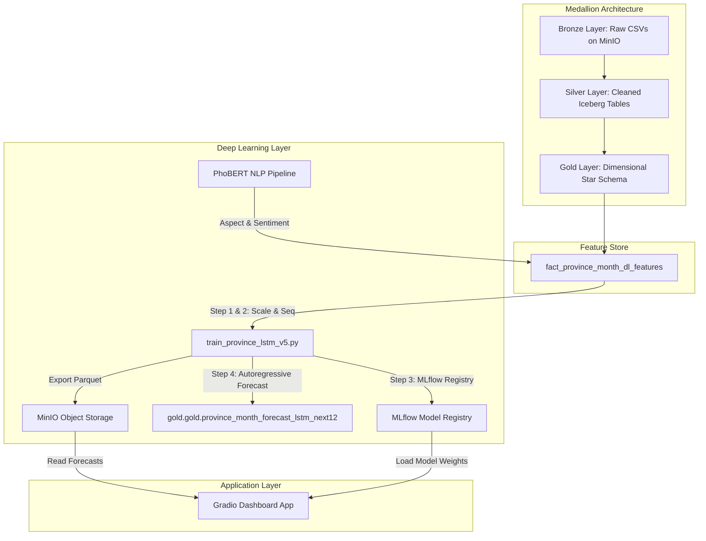

# TÀI LIỆU TOÀN DIỆN VỀ MÔ HÌNH DỰ BÁO CHUỖI THỜI GIAN LSTM/GRU (V5.0)
> **Đề tài:** Xây dựng Lakehouse và mô hình Deep Learning dự báo xu hướng du lịch từ dữ liệu mạng xã hội và đánh giá trực tuyến
> **Mục tiêu tài liệu:** Cung cấp cơ sở lý thuyết học sâu chi tiết, giải thích cấu trúc mã nguồn của file [train_province_lstm_v5.py](file:///d:/CodeStored/Nam_4/TieuLuanCuoiKy/LakeHouse/LakeHousePj/spark/jobs/dl/train_province_lstm_v5.py), và cách thức tích hợp từ tầng Gold đến ứng dụng đầu ra phục vụ chuẩn bị phản biện khóa luận.

---

## 1. Vị trí và Vai trò của Mô hình trong Hệ thống

Trong kiến trúc Medallion Lakehouse của dự án, mô hình dự báo chuỗi thời gian nằm ở tầng **ML/BI Layer**, đóng vai trò là "bộ não" đưa ra các dự báo xu hướng tương lai.



* **Dữ liệu đầu vào:** Bảng đặc trưng tích hợp **Tỉnh thành theo Tháng** (`fact_province_month_dl_features`) với **47 đặc trưng** kết hợp từ TikTok (Chỉ số tương tác, cảm xúc tích cực/tiêu cực, khía cạnh bình luận bằng PhoBERT) và Booking.com (Rating, tỷ lệ du khách gia đình/cặp đôi/công tác/đơn lẻ).
* **Biến mục tiêu (Target):** Lượng đặt phòng khách sạn (thông qua proxy số lượng đánh giá `hotel_review_volume`) được xử lý dưới thang đo logarit nhằm ổn định phương sai.
* **Đầu ra:** Dự báo tự hồi quy (Autoregressive Forecast) cho 12 tháng tiếp theo của 63 tỉnh thành Việt Nam, lưu trữ vào bảng Iceberg Gold và xuất bản lên MinIO phục vụ **Gradio Dashboard**.

---

## 2. Cơ sở Lý thuyết chi tiết (Theoretical Foundations)

Để bảo vệ thành công trước Hội đồng, bạn cần nắm vững bản chất toán học của các thành phần học sâu được áp dụng trong mô hình:

### 2.1. Mạng hồi quy LSTM (Long Short-Term Memory)
Mạng hồi quy truyền thống (RNN) gặp phải hiện tượng **tiêu biến Gradient** (Vanishing Gradient) khi xử lý các chuỗi thời gian dài do việc nhân liên tiếp các ma trận trọng số trong quá trình lan truyền ngược qua thời gian (BPTT). LSTM giải quyết vấn đề này bằng cách giới thiệu cấu trúc **ô nhớ** (Cell State - $C_t$) chạy xuyên suốt chuỗi và được điều tiết bởi 3 cổng (Gates):

```
                       Cell State (C_t)
   C_{t-1} ───────┬───────────────────────────────► C_t
                  │                       ▲
                  ▼                       │
            ┌───────────┐           ┌───────────┐
            │Forget Gate│           │Input Gate │
            └─────┬─────┘           └─────┬─────┘
                  │                       │
                  ▼                       ▼
   h_{t-1} ───────┼───────────┬───────────┼───────► h_t
                  │           │           │
   x_t ───────────┴───────────┴───────────┴──────── (Input)
```

1. **Cổng quên (Forget Gate - $f_t$):** Quyết định thông tin nào từ quá khứ sẽ bị xóa bỏ khỏi ô nhớ.
   $$f_t = \sigma(W_f \cdot [h_{t-1}, x_t] + b_f)$$
2. **Cổng vào (Input Gate - $i_t$) & Trạng thái ô nhớ ứng viên ($\tilde{C}_t$):** Quyết định thông tin mới nào sẽ được ghi lại vào ô nhớ.
   $$i_t = \sigma(W_i \cdot [h_{t-1}, x_t] + b_i)$$
   $$\tilde{C}_t = \tanh(W_c \cdot [h_{t-1}, x_t] + b_c)$$
   *Cập nhật Cell State mới:*
   $$C_t = f_t * C_{t-1} + i_t * \tilde{C}_t$$
3. **Cổng ra (Output Gate - $o_t$) & Trạng thái ẩn (Hidden State - $h_t$):** Quyết định giá trị đầu ra của bước thời gian hiện tại để truyền đi tiếp.
   $$o_t = \sigma(W_o \cdot [h_{t-1}, x_t] + b_o)$$
   $$h_t = o_t * \tanh(C_t)$$

Trong đó $\sigma$ là hàm kích hoạt Sigmoid đưa giá trị về khoảng $(0, 1)$, $\tanh$ đưa giá trị về $(-1, 1)$, $x_t$ là vector đặc trưng đầu vào tại bước $t$, và $h_{t-1}$ là trạng thái ẩn của bước thời gian trước.

### 2.2. Cơ chế chú ý theo thời gian (Temporal Attention)
Thông thường, khi dùng RNN/LSTM cho dự báo, người ta chỉ lấy trạng thái ẩn cuối cùng $h_L$ (với $L$ là độ dài chuỗi) để đưa vào tầng phân loại/hồi quy. Tuy nhiên, các tháng lịch sử khác nhau có mức độ đóng góp khác nhau vào xu hướng tương lai. Cơ chế **Temporal Attention** cho phép mô hình tính toán trọng số động $\alpha_t$ đại diện cho tầm quan trọng của từng bước thời gian $t \in [1, L]$:

1. **Tính điểm liên kết (Alignment Score - $e_t$):**
   $$e_t = W_a \cdot h_t + b_a$$ (Dùng một lớp tuyến tính `nn.Linear(hidden_size, 1)`)
2. **Tính trọng số chú ý ($\alpha_t$) bằng Softmax qua các timestep:**
   $$\alpha_t = \frac{\exp(e_t)}{\sum_{i=1}^L \exp(e_i)}$$
3. **Tính toán Vector ngữ cảnh (Context Vector - $v$):**
   $$v = \sum_{t=1}^L \alpha_t h_t$$

Vector ngữ cảnh $v$ tập hợp thông tin từ toàn bộ chuỗi lịch sử dựa trên trọng số chú ý đã học, giúp giảm thiểu hiện tượng mất mát thông tin đối với chuỗi dài.

### 2.3. Chuẩn hóa tầng (Layer Normalization)
Trái ngược với BatchNorm chuẩn hóa dọc theo chiều Batch (phụ thuộc vào kích thước Batch), **LayerNorm** chuẩn hóa các giá trị kích hoạt dọc theo chiều Đặc trưng (Feature Dimension) của từng mẫu dữ liệu riêng biệt:

$$\mu_i = \frac{1}{H} \sum_{j=1}^H a_{ij}, \quad \sigma_i^2 = \frac{1}{H} \sum_{j=1}^H (a_{ij} - \mu_i)^2$$
$$\hat{a}_{ij} = \frac{a_{ij} - \mu_i}{\sqrt{\sigma_i^2 + \epsilon}} \cdot \gamma + \beta$$

* **Tại sao dùng LayerNorm cho LSTM chuỗi thời gian?**
  Khi chạy dự báo tự hồi quy (Autoregressive) 12 tháng tiếp theo, ta dự báo từng tỉnh một cách độc lập và đệ quy. Lúc này, **kích thước Batch đưa vào mô hình bắt buộc phải bằng 1**. BatchNorm không thể hoạt động ổn định khi Batch size = 1 vì phương sai mẫu bằng 0. LayerNorm chuẩn hóa nội bộ từng timestep nên hoạt động hoàn hảo ở cả giai đoạn Train (Batch lớn) lẫn giai đoạn Inference (Batch = 1).

### 2.4. Hàm mất mát tích hợp (Hybrid Loss Function)
Mô hình v5.0 sử dụng hàm mất mát kết hợp giữa Huber Loss và SMAPE Loss theo tỷ lệ 70:30:

$$\mathcal{L}_{\text{Total}} = 0.7 \times \mathcal{L}_{\text{Huber}}(\delta=0.5) + 0.3 \times \mathcal{L}_{\text{SMAPE}}$$

1. **Huber Loss ($\delta = 0.5$):**
   $$\mathcal{L}_{\text{Huber}}(e) = \begin{cases} \frac{1}{2} e^2 & \text{nếu } |e| \le \delta \\ \delta (|e| - \frac{1}{2} \delta) & \text{nếu } |e| > \delta \end{cases}$$
   *Ý nghĩa:* Đóng vai trò là hàm bậc hai (MSE) khi sai số nhỏ giúp mô hình hội tụ mịn màng, và trở thành hàm tuyến tính (MAE) khi sai số lớn để hạn chế hình phạt đối với các giá trị ngoại lai (outliers - ví dụ: những đột biến tương tác do video TikTok triệu view đột ngột xuất hiện). Thiết lập $\delta = 0.5$ trên thang đo logarit tương ứng với mức sai lệch thực tế khoảng $e^{0.5} \approx 1.65$ lần.
2. **Symmetric Mean Absolute Percentage Error (SMAPE Loss):**
   $$\mathcal{L}_{\text{SMAPE}}(y, \hat{y}) = \frac{1}{N} \sum_{i=1}^N \frac{|y_i - \hat{y}_i|}{(|y_i| + |\hat{y}_i|)/2 + \epsilon}$$
   *Ý nghĩa:* Huber hay MSE/MAE đo lường sai số tuyệt đối, dẫn đến việc mô hình có xu hướng ưu tiên học chính xác cho các tỉnh lớn (Hà Nội, TP.HCM có lượng phòng lớn nên sai số tuyệt đối lớn) và bỏ rơi các tỉnh nhỏ. SMAPE đo lường sai số phần trăm, giúp cân bằng sự công bằng giữa các quy mô tỉnh thành khác nhau.

---

## 3. Cấu trúc và Luồng chạy của Mã nguồn

Mã nguồn [train_province_lstm_v5.py](file:///d:/CodeStored/Nam_4/TieuLuanCuoiKy/LakeHouse/LakeHousePj/spark/jobs/dl/train_province_lstm_v5.py) được thực thi qua hàm khởi tạo `main()` và chia làm 4 bước lớn:

```
[Khởi động Spark Session]
        │
        ▼
[STEP 1: Load features từ Gold Table]
        │
        ▼
[STEP 2: Tiền xử lý dữ liệu chống rò rỉ (Leakage)]
        │ ├── Chia train/val/test theo mốc thời gian
        │ ├── Clip ngoại lệ & Fit RobustScaler trên TRAIN ONLY
        │ └── Tạo ma trận chuỗi trượt (Sliding Window L=3)
        ▼
[STEP 3: Huấn luyện LSTM v5]
        │ ├── Tối ưu hóa bằng CosineAnnealingWarmRestarts
        │ ├── Early stopping trên tập Validation độc lập
        │ ├── Đánh giá final metrics trên tập Test độc lập
        │ └── Log model & metrics lên MLflow
        ▼
[STEP 4: Dự báo tự hồi quy 12 tháng kế tiếp]
        │ ├── Đệ quy cập nhật các đặc trưng lag
        │ ├── Persistence assumption cho đặc trưng social/NLP
        │ ├── Khử log (expm1) về volume thực tế
        │ └── Ghi kết quả vào bảng Iceberg Gold & MinIO
        ▼
[Kết thúc Spark Session]
```

### Bước 1: Tải đặc trưng học máy (Load Features)
Hàm `load_features(spark)` đọc dữ liệu trực tiếp từ bảng đặc trưng `gold.gold.fact_province_month_dl_features`.
* **Loại bỏ dữ liệu thiếu:** Lọc bỏ các dòng có biến mục tiêu bằng 0 hoặc các đặc trưng lag bị rỗng (`dropna` trên `hotel_vol_lag` và lọc `TARGET > 0`).
* **Kiểm tra và điền khuyết:** Nếu có các cột đặc trưng mới chưa kịp tính toán ở Gold ETL, hệ thống sẽ tự động điền giá trị 0.0 để tránh lỗi huấn luyện mạng neural.

### Bước 2: Tiền xử lý dữ liệu và Tạo chuỗi (Preprocessing Helpers)
* **Log-Transform Target:** Áp dụng công thức $y_{\text{scaled}} = \log(1+y)$ nhằm giảm phương sai chênh lệch khổng lồ giữa các tỉnh nhỏ và tỉnh lớn.
* **Ngăn chặn rò rỉ dữ liệu (Anti Data-Leakage):**
  * Chia tập dữ liệu theo mốc thời gian (`year_month`): $75\%$ làm Train, $12.5\%$ làm Validation, và $12.5\%$ làm Test.
  * Việc tính toán giá trị phân vị $p_{99}$ để cắt ngoại lai (outlier clipping) và tính Trung vị (Median), khoảng tứ phân vị (IQR) cho `RobustScaler` **chỉ thực hiện trên tập Train**.
  * Sau đó, các thông số tĩnh này mới được áp dụng (transform) đồng nhất sang tập Validation và Test.
* **Giải quyết mất dữ liệu biên phân cắt (Boundary Sequence Loss):**
  Hàm `prepare_sequences()` gom nhóm theo từng tỉnh và sắp xếp theo trình tự thời gian tăng dần để tạo chuỗi trượt 3 tháng liên tiếp ($3 \text{ tháng} \times 47 \text{ đặc trưng}$). Chuỗi trượt được tạo trên toàn bộ bảng dữ liệu liên tục trước, sau đó mới chia ma trận chuỗi vào các tập Train, Val, Test dựa trên nhãn thời gian của biến mục tiêu cần dự báo. Điều này giúp không bị mất các mẫu dữ liệu ở ranh giới giao nhau giữa các tập.

### Bước 3: Huấn luyện và Đánh giá (Model Training)
Hàm `train_single_lstm()` khởi tạo mạng Neural `LSTMForecaster` và tối ưu trọng số:
* **Bộ tối ưu hóa (Optimizer):** Adam với hệ số suy giảm trọng số `weight_decay = 7e-4` (L2 regularization) giúp kiểm soát overfitting.
* **Scheduler:** `CosineAnnealingWarmRestarts` được cấu hình với chu kỳ ban đầu $T_0 = 30$ epoch, nhân tử chu kỳ $T_{\text{mult}} = 2$.
  * *Sửa lỗi v5.0:* Lệnh cập nhật được điều chỉnh về `scheduler.step(epoch)` (step theo tọa độ epoch thay vì truyền loss).
* **Early Stopping:** Đo lường tổn thất (Loss) trên tập **Validation** sau mỗi epoch. Nếu val loss không cải thiện liên tục sau 25 epochs (`patience=25`), quá trình huấn luyện dừng lại để tránh quá khớp.
* **Final Evaluation:** Sau khi kết thúc huấn luyện, mô hình tốt nhất được tải lại và đánh giá duy nhất một lần trên tập **Test** độc lập. Các chỉ số được báo cáo gồm $RMSE, MAE, R^2$ trên thang log, cùng với $MAPE_{\text{actual}}$ và $SMAPE_{\text{log}}$ trên thang đo thực tế.
* **MLflow Tracking:** Toàn bộ tham số cấu hình, biểu đồ Loss Curve, Actual vs Predicted và mô hình đã huấn luyện được lưu trữ tập trung vào MLflow Registry.

### Bước 4: Dự báo tự hồi quy 12 tháng (Autoregressive Forecasting)
Hàm `forecast_12_months()` thực hiện chiến lược dự báo tịnh tiến đệ quy từng bước cho tương lai (12 tháng kế tiếp):

```
Tháng hiện tại (Dự báo tịnh tiến tiếp theo)
        │
        ├─► Dự báo tháng t+1 từ chuỗi lịch sử [t-2, t-1, t]
        │
        ├─► Cập nhật chuỗi lịch sử mới:
        │     Bỏ [t-2], Đẩy giá trị vừa dự báo [t+1] vào làm lịch sử
        │
        ├─► Cập nhật các đặc trưng Lag:
        │     - hotel_vol_lag_1 = Dự báo mới (được scaler chuẩn hóa)
        │     - hotel_vol_lag_2/3/12 = dịch chuyển từ các bước trước
        │     - hotel_vol_rolling_3m, hotel_vol_momentum = Tính toán động
        │
        ├─► Giữ nguyên các biến Social/NLP (Persistence Assumption)
        │
        └─► Lặp lại cho đến khi đủ 12 tháng
```

* **Cơ chế đệ quy (Autoregressive):** Dự báo giá trị log-volume của tháng $t+1$, sau đó dùng chính kết quả dự báo này (sau khi đi qua RobustScaler) để cập nhật làm đặc trưng lag `hotel_vol_lag_1` cho việc dự báo tháng $t+2$.
* **Cập nhật động (Dynamic Update):** Các chỉ số trung bình trượt `hotel_vol_rolling_3m`, xung lượng `hotel_vol_momentum`, và tỷ lệ tăng trưởng `hotel_vol_growth` được cập nhật động từ các giá trị dự báo trước đó.
* **Giả định duy trì (Persistence Assumption):** Do không thể thu thập được dữ liệu tương tác TikTok hay bình luận mạng xã hội trong tương lai 12 tháng tới, các đặc trưng này (gồm cả khía cạnh và cảm xúc PhoBERT) được giữ nguyên theo trạng thái của tháng cuối cùng có dữ liệu thực tế.
* **Khử Log (Inverse Transform):** Dùng hàm **`expm1`** ($e^y - 1$) để đưa kết quả dự báo từ dạng log-scale về số lượng đánh giá thực tế trước khi ghi xuống.
* **Lưu trữ:** Dữ liệu kết quả dự báo được ghi đè vào bảng Iceberg Gold `gold.gold.province_month_forecast_lstm_next12` và xuất ra file Parquet trên MinIO.

---

## 4. Tích hợp từ Gold Layer đến Ứng dụng Gradio (End-to-End Flow)

Luồng hoạt động hoàn thiện từ kho dữ liệu đến ứng dụng hiển thị được vận hành như sau:

```
┌─────────────────────────────────────────────────────────┐
│                    GOLD LAYER (Iceberg)                 │
│  - gold.gold.fact_province_month_dl_features            │
└────────────────────────────┬────────────────────────────┘
                             │
                             ▼
┌─────────────────────────────────────────────────────────┐
│                   LSTM MODEL RUN (v5.0)                 │
│  - Đọc data từ Gold, chạy huấn luyện và dự báo.        │
│  - Đăng ký model lên MLflow Model Registry.             │
│  - Lưu trữ scaler.pkl và config.json dưới dạng artifact.│
└──────────────┬───────────────────────────┬──────────────┘
               │                           │
               ▼ (Ghi bảng Iceberg)        ▼ (Xuất Parquet)
┌────────────────────────────┐ ┌──────────────────────────┐
│         GOLD LAYER         │ │      MINIO STORAGE       │
│  Bảng kết quả dự báo 12T.  │ │  Parquet file dự báo.   │
└────────────────────────────┘ └───────────┬──────────────┘
                                           │
                                           ▼ (Đọc file dự báo)
                               ┌──────────────────────────┐
                               │     GRADIO DASHBOARD     │
                               │  - Hiển thị dự báo 12T.  │
                               │  - Xếp hạng tỉnh thành.  │
                               └──────────────────────────┘
```

1. **Từ Gold Layer đến Model:**
   Spark job [train_province_lstm_v5.py](file:///d:/CodeStored/Nam_4/TieuLuanCuoiKy/LakeHouse/LakeHousePj/spark/jobs/dl/train_province_lstm_v5.py) đọc bảng đặc trưng tại Gold Layer để thực hiện huấn luyện và dự báo.
2. **MLflow Registry & Artifacts:**
   Khi quá trình huấn luyện hoàn tất, mô hình được lưu lại trên MLflow kèm theo file `scaler_lstm_v5.pkl` (dùng để chuẩn hóa ngược/xuôi dữ liệu mới) và `feature_config_v5.json` (chứa danh sách cấu hình đặc trưng).
3. **Từ Model đến Storage:**
   Hàm `forecast_12_months` xuất kết quả dự báo ra hai đầu ra:
   * Ghi vào bảng Iceberg `gold.gold.province_month_forecast_lstm_next12` để phục vụ các câu truy vấn SQL hay báo cáo tổng hợp.
   * Xuất ra file Parquet duy nhất tại `s3a://gold/dl_forecast/province_hotel_volume_forecast_lstm_v5` trên MinIO.
4. **Từ Storage đến Gradio App:**
   Giao diện Gradio [app_lstm_volume.py](file:///d:/CodeStored/Nam_4/TieuLuanCuoiKy/LakeHouse/LakeHousePj/gradio/app_lstm_volume.py) đọc file Parquet dự báo từ MinIO, sử dụng cơ chế bộ đệm (Caching) để tăng tốc độ tải. Người dùng có thể chọn Tỉnh/Thành phố trên giao diện để vẽ biểu đồ so sánh xu hướng du lịch thực tế với dự báo 12 tháng tới, hiển thị bảng xếp hạng độ hot du lịch và cơ cấu du khách theo thời gian thực.

---

## 5. Danh sách các câu hỏi chất vấn tiềm năng về LSTM (Hội đồng phản biện)

Dưới đây là một số câu hỏi sâu về phần kỹ thuật mô hình dự báo mà các thầy cô có thể hỏi, kèm theo định hướng trả lời để bạn tự tin ứng phó:

* **Hỏi:** *Tại sao em sử dụng biến mục tiêu là lượng review (`hotel_review_volume`) chứ không phải lượng khách du lịch thực tế?*
  * **Trả lời:** Thưa thầy/cô, lượng khách du lịch thực tế do Tổng cục Du lịch công bố thường có độ trễ lớn (theo quý hoặc năm) và không có độ chi tiết theo từng tháng của toàn bộ 63 tỉnh thành. Việc sử dụng số lượng đánh giá lưu trú trên Booking.com (`hotel_review_volume`) làm biến đại diện (proxy) là một giải pháp phổ biến trong các nghiên cứu kinh tế số, vì số lượng review tỷ lệ thuận với số lượt lưu trú thực tế tại địa phương đó và có tính cập nhật tức thời theo dòng chảy thời gian thực.
* **Hỏi:** *Tại sao em lại kết hợp mạng LSTM với cơ chế Attention mà không dùng Transformer cho chuỗi thời gian?*
  * **Trả lời:** Thưa thầy/cô, kiến trúc Transformer nổi tiếng với khả năng xử lý song song và tự chú ý (Self-Attention) rất mạnh mẽ, nhưng nó đòi hỏi một lượng dữ liệu huấn luyện cực kỳ lớn để đạt được sự hội tụ. Trong đề tài này, độ dài chuỗi lịch sử đầu vào khá ngắn (chỉ 3 tháng lịch sử gần nhất để dự báo tháng tiếp theo). Với chuỗi ngắn và kích thước dữ liệu quy mô trung bình, LSTM kết hợp Temporal Attention là lựa chọn tối ưu hơn: nó vừa giữ được tính tuần tự tự nhiên của chuỗi thời gian, vừa giúp mô hình tập trung vào các tháng quan trọng mà không làm bùng nổ số lượng tham số huấn luyện, tránh được hiện tượng quá khớp (overfitting).
* **Hỏi:** *Tại sao mô hình v5.0 lại chuyển từ 2-way split sang 3-way split? Sự khác biệt ở đây là gì?*
  * **Trả lời:** Thưa thầy/cô, ở phiên bản trước, việc chia dữ liệu dạng 2-way (Train/Test) và sử dụng ngay tập Test làm dữ liệu Validation để kích hoạt Early Stopping đã vô tình gây ra hiện tượng rò rỉ thông tin nhẹ. Khi đó, mô hình sẽ dừng huấn luyện dựa trên hiệu năng của tập Test, khiến các chỉ số đánh giá trên tập Test trở nên lạc quan hơn thực tế. Trong phiên bản v5.0, nhóm đã thiết lập quy trình 3-way split chuẩn mực: tập Train dùng để học trọng số, tập Validation độc lập dùng để tối ưu hóa siêu tham số và kích hoạt Early Stopping, còn tập Test hoàn toàn bị cô lập và chỉ được đưa ra đánh giá duy nhất một lần ở cuối cùng để đảm bảo tính khách quan và trung thực của kết quả.
* **Hỏi:** *Việc áp dụng giả định duy trì (Persistence Assumption) cho các biến mạng xã hội khi dự báo tương lai 12 tháng có ảnh hưởng đến độ chính xác không?*
  * **Trả lời:** Thưa thầy/cô, đây là một giới hạn thực tế của bài toán. Vì tương lai chưa xảy ra, chúng ta hoàn toàn không có dữ liệu về các bài đăng hay bình luận TikTok của 12 tháng tới để đưa vào mô hình. Do đó, việc giữ cố định các đặc trưng này bằng giá trị thực tế của tháng gần nhất là giải pháp khả thi nhất. Giả định này phản ánh rằng xu hướng quan tâm và cảm nhận của cộng đồng trên mạng xã hội về một địa phương có tính ổn định tương đối trong ngắn hạn. Tuy nhiên, các đặc trưng động về mặt thời gian (sin, cos) và các lag volume khách sạn vẫn được cập nhật liên tục đệ quy, đảm bảo mô hình vẫn bắt được tính chu kỳ mùa vụ và xu hướng tịnh tiến tự hồi quy của du lịch.
