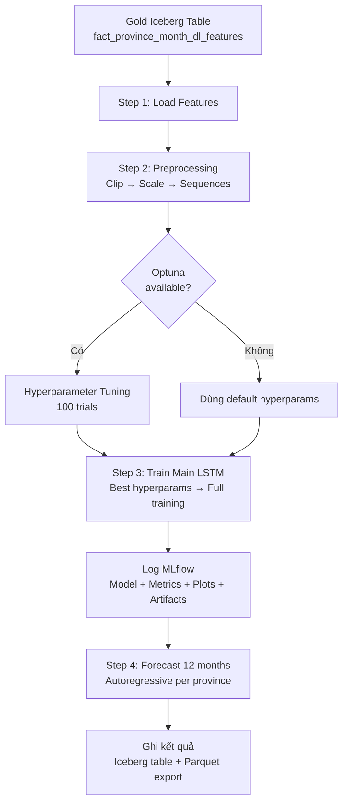
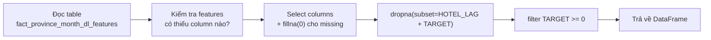
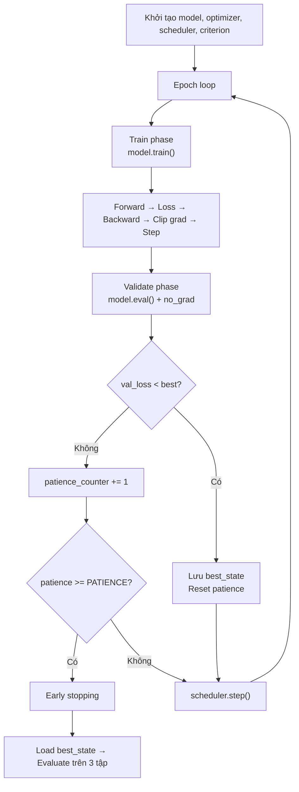
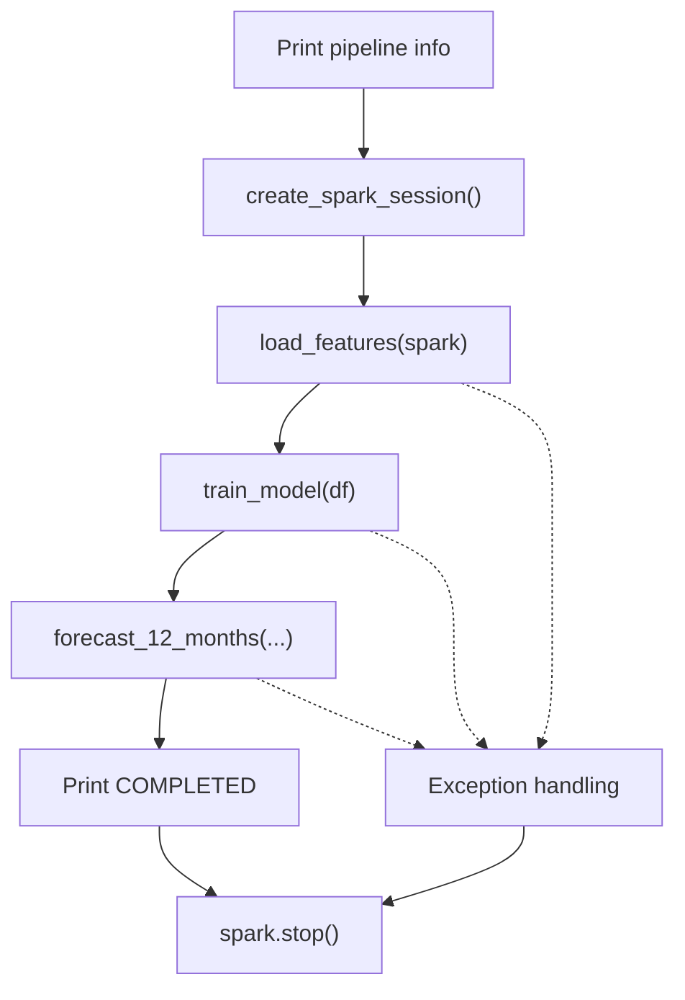

# Tài Liệu Kỹ Thuật: LSTM v5 — Province Hotel Volume Forecasting Pipeline

> **File source**: [`train_province_lstm_v5.py`](file:///d:/CodeStored/Nam_4/TieuLuanCuoiKy/LakeHouse/LakeHousePj/spark/jobs/dl/train_province_lstm_v5.py)  
> **Model name**: `province_hotel_volume_forecaster_lstm_v5`  
> **Registry**: MLflow Model Registry  
> **Output table**: `gold.gold.province_month_forecast_lstm_next12`

---

## Mục Lục

1. [Tổng Quan Pipeline](#1-tổng-quan-pipeline)
2. [Kiến Trúc Tổng Thể](#2-kiến-trúc-tổng-thể)
3. [Cấu Hình & Hằng Số](#3-cấu-hình--hằng-số)
4. [Feature Engineering — 39 Features](#4-feature-engineering--39-features)
5. [Step 1: Load Features](#5-step-1-load-features)
6. [Step 2: Preprocessing](#6-step-2-preprocessing)
7. [Kiến Trúc Model LSTM](#7-kiến-trúc-model-lstm)
8. [Loss Function — HybridLoss](#8-loss-function--hybridloss)
9. [Step 3: Training Pipeline](#9-step-3-training-pipeline)
10. [Hyperparameter Tuning — Optuna](#10-hyperparameter-tuning--optuna)
11. [Metrics & Evaluation](#11-metrics--evaluation)
12. [Plotting & Visualization](#12-plotting--visualization)
13. [Artifacts & MLflow Logging](#13-artifacts--mlflow-logging)
14. [Step 4: Forecast 12 Tháng](#14-step-4-forecast-12-tháng)
15. [Main Entry Point](#15-main-entry-point)
16. [Dependencies & Infrastructure](#16-dependencies--infrastructure)
17. [Ghi Chú Kỹ Thuật & Cải Tiến Tiềm Năng](#17-ghi-chú-kỹ-thuật--cải-tiến-tiềm-năng)

---

## 1. Tổng Quan Pipeline

Pipeline này thực hiện **dự báo lượng đánh giá khách sạn theo tỉnh/thành** (hotel review volume) cho 12 tháng tới, sử dụng mô hình LSTM (Long Short-Term Memory) deep learning.

### Workflow tổng quát

```
┌─────────────────────────────────────────────────────────────────┐
│                    ML Pipeline — LSTM v5                        │
│                                                                 │
│  1. Load Features   ─→  Đọc dữ liệu từ Gold layer (Iceberg)   │
│  2. Preprocessing   ─→  Clip outlier, Scale, Tạo sequences     │
│  3. Train Model     ─→  Optuna tuning → Train LSTM → Log MLflow│
│  4. Forecast        ─→  Autoregressive 12 tháng → Ghi Iceberg  │
└─────────────────────────────────────────────────────────────────┘
```

### Đặc trưng chính của v5

| Đặc điểm | Mô tả |
|-----------|-------|
| **Architecture** | 1–2 layer LSTM + LayerNorm + Temporal Attention + deep FC head |
| **Loss** | HybridLoss = 70% HuberLoss + 30% SMAPELoss |
| **Scaler** | RobustScaler (fit on train only, loại trừ temporal/ratio/sentiment) |
| **Scheduler** | CosineAnnealingWarmRestarts (T₀=30, T_mult=2) |
| **Tuning** | Optuna (100 trials) |
| **Features** | 39 features thuộc 9 nhóm |
| **Target transform** | `log1p(hotel_review_volume)` |
| **Data split** | 75% Train / 12.5% Val / 12.5% Test (time-based) |
| **Forecast** | 12 tháng, autoregressive, persistence assumption cho social/NLP features |

---

## 2. Kiến Trúc Tổng Thể



---

## 3. Cấu Hình & Hằng Số

> Dòng [96–132](file:///d:/CodeStored/Nam_4/TieuLuanCuoiKy/LakeHouse/LakeHousePj/spark/jobs/dl/train_province_lstm_v5.py#L96-L132)

### Infrastructure

| Hằng số | Giá trị | Mô tả |
|---------|---------|-------|
| `MLFLOW_TRACKING_URI` | `http://mlflow:5000` | MLflow server endpoint |
| `EXPERIMENT_NAME` | `province_hotel_volume_forecasting_lstm` | Tên experiment trên MLflow |
| `MODEL_NAME` | `province_hotel_volume_forecaster_lstm_v5` | Tên model đăng ký registry |
| `DL_FEATURES_TABLE` | `gold.gold.fact_province_month_dl_features` | Source table (Iceberg) |

### Training Configuration

| Hằng số | Giá trị | Mô tả |
|---------|---------|-------|
| `FORECAST_MONTHS` | 12 | Số tháng dự báo |
| `TRAIN_RATIO` | 0.75 | Tỷ lệ train trong time-based split |
| `VAL_RATIO` | 0.125 | Tỷ lệ validation |
| `TEST_RATIO` | 0.125 | Tỷ lệ test (tính tự động: 1 − 0.75 − 0.125) |
| `SEQUENCE_LENGTH` | 3 | Số time steps trong mỗi input sequence |
| `EPOCHS` | 200 | Số epoch tối đa (full training) |
| `BATCH_SIZE` | 32 | Kích thước batch |
| `PATIENCE` | 25 | Early stopping patience |
| `FOURIER_K` | 1 | Số bậc Fourier cho seasonality encoding (1 = sin/cos cơ bản) |

### Default Hyperparameters (Fallback)

Dùng khi Optuna không khả dụng:

| Hằng số | Giá trị |
|---------|---------|
| `DEFAULT_HIDDEN_SIZE` | 48 |
| `DEFAULT_NUM_LAYERS` | 2 |
| `DEFAULT_DROPOUT` | 0.43 |
| `DEFAULT_LEARNING_RATE` | 0.0005 |
| `DEFAULT_WEIGHT_DECAY` | 7×10⁻⁴ |

### Optuna Tuning Configuration

| Hằng số | Giá trị | Mô tả |
|---------|---------|-------|
| `TUNING_EPOCHS` | 150 | Epoch tối đa mỗi trial |
| `TUNING_PATIENCE` | 20 | Early stopping mỗi trial |
| `N_TRIALS` | 100 | Tổng số trials Optuna |

---

## 4. Feature Engineering — 39 Features

> Dòng [135–204](file:///d:/CodeStored/Nam_4/TieuLuanCuoiKy/LakeHouse/LakeHousePj/spark/jobs/dl/train_province_lstm_v5.py#L135-L204)

### Bảng tổng hợp 9 nhóm Features

| # | Nhóm | Số lượng | Features | Ý nghĩa |
|---|------|----------|----------|----------|
| 1 | **Temporal** | 2 | `month_sin`, `month_cos` | Fourier encoding tháng (seasonality). Với `FOURIER_K > 1` sẽ thêm harmonics `month_sin_k2`, `month_cos_k2`,... |
| 2 | **Hotel Lag** | 3 | `hotel_vol_lag_12`, `hotel_vol_rolling_3m`, `hotel_vol_momentum` | Lag 12 tháng, trung bình trượt 3 tháng, momentum (so sánh hiện tại vs 3 tháng trước) |
| 3 | **Hotness Lag** | 3 | `hotness_lag_12`, `hotness_rolling_3m`, `hotness_momentum` | Tương tự Hotel Lag nhưng cho chỉ số "hotness" (social media) |
| 4 | **Volume** | 3 | `total_posts`, `total_comments`, `comments_per_post` | Lượng bài viết/bình luận social media |
| 5 | **Engagement** | 4 | `avg_likes_per_post`, `avg_saves_per_post`, `viral_post_ratio`, `engagement_score` | Chỉ số tương tác mạng xã hội |
| 6 | **NLP** | 6 | `avg_sentiment`, `sentiment_std`, `positive_ratio`, `negative_ratio`, `emoji_sentiment_ratio`, `reply_ratio` | Phân tích cảm xúc từ NLP |
| 7 | **Aspect** | 6 | `avg_aspect_scenery`, `avg_aspect_food`, `avg_aspect_price`, `avg_aspect_service`, `avg_aspect_transport`, `avg_aspect_accommodation` | Điểm đánh giá từng khía cạnh (scenery/food/price/...) từ PhoBERT aspect extraction |
| 8 | **Hotel Quality** | 9 | `avg_hotel_score`, `hotel_score_std`, `high_score_ratio`, `domestic_review_ratio`, `couple_ratio`, `family_ratio`, `business_ratio`, `solo_ratio`, `hotel_vol_growth` | Chất lượng & đặc tính đánh giá khách sạn |
| 9 | **Custom** | 3 | `social_to_booking_ratio`, `sentiment_polarity_change`, `hotel_vol_std_rolling_3m` | Features tự thiết kế: tỷ lệ social/booking, biến động sentiment, std trượt 3 tháng |

**Tổng: 39 features**

### Features KHÔNG được scale (UNSCALED_FEATURES)

> Dòng [198–204](file:///d:/CodeStored/Nam_4/TieuLuanCuoiKy/LakeHouse/LakeHousePj/spark/jobs/dl/train_province_lstm_v5.py#L198-L204)

Các features thuộc dạng **ratio/proportion** (đã trong [0,1]), **sentiment scores**, **aspect scores** và **temporal encoding** sẽ **không** được áp dụng RobustScaler. Lý do: chúng đã có phân bố chuẩn hoá tự nhiên hoặc giá trị bounded, việc scale thêm sẽ làm mất ý nghĩa trực tiếp.

Danh sách cụ thể:
- `viral_post_ratio`
- Toàn bộ NLP features: `avg_sentiment`, `sentiment_std`, `positive_ratio`, `negative_ratio`, `emoji_sentiment_ratio`, `reply_ratio`
- Toàn bộ Aspect features: `avg_aspect_scenery`, ..., `avg_aspect_accommodation`
- Các ratio trong Hotel: `high_score_ratio`, `domestic_review_ratio`, `couple_ratio`, `family_ratio`, `business_ratio`, `solo_ratio`
- `sentiment_polarity_change`
- Toàn bộ Temporal features: `month_sin`, `month_cos`

---

## 5. Step 1: Load Features

> Hàm [`load_features(spark)`](file:///d:/CodeStored/Nam_4/TieuLuanCuoiKy/LakeHouse/LakeHousePj/spark/jobs/dl/train_province_lstm_v5.py#L311-L362)

### Luồng xử lý



### Chi tiết

1. **Đọc bảng Iceberg** `gold.gold.fact_province_month_dl_features` qua Spark SQL
2. **Kiểm tra missing features**: So sánh `ALL_FEATURES` với cột thực tế trong bảng. Nếu thiếu → in cảnh báo và fill bằng `0.0`
3. **Safe select**: Chỉ select các cột thực sự tồn tại + các cột metadata (`year_month`, `month`, `province_sk`, `province_name`, `region`) → loại trùng bằng `dict.fromkeys()`
4. **Loại bỏ dữ liệu thiếu**: Drop các row có NULL ở `HOTEL_LAG_FEATURES` hoặc `TARGET`
5. **Loại bỏ target âm**: Filter `hotel_review_volume >= 0`
6. In thống kê: số row còn lại, số tỉnh, số features theo nhóm

---

## 6. Step 2: Preprocessing

### 6.1. Hàm `clip_and_scale_entire()`

> Dòng [369–408](file:///d:/CodeStored/Nam_4/TieuLuanCuoiKy/LakeHouse/LakeHousePj/spark/jobs/dl/train_province_lstm_v5.py#L369-L408)

**Mục đích**: Xử lý outlier và chuẩn hoá features, đảm bảo **không có data leakage** (chỉ fit trên train set).

#### Bước 1 — Clipping cố định

| Feature | Xử lý |
|---------|-------|
| `hotel_vol_growth` | Clip vào khoảng [-1.0, 5.0] |
| `engagement_score` | Biến đổi `log1p()` để giảm skewness |

#### Bước 2 — P99 Clipping (train-derived)

Tính percentile 99 **chỉ trên tập train** cho các cột:
- `total_posts`, `total_comments`, `avg_likes_per_post`, `avg_saves_per_post`, `engagement_score`

Áp dụng `clip(upper=p99)` lên **toàn bộ dataset** (bao gồm val và test).

> **Thiết kế quan trọng**: Thresholds tính trên train → áp toàn bộ. Điều này ngăn data leakage và đảm bảo test set được xử lý consistent.

#### Bước 3 — RobustScaler

- **Chỉ fit** trên subset `train_mask` (rows có `year_month <= train_end`)
- **Chỉ scale** các features không nằm trong `UNSCALED_FEATURES`
- **Transform** toàn bộ dataset (train + val + test)
- Sử dụng `RobustScaler` (dựa trên median và IQR) → robust với outlier hơn StandardScaler

**Trả về**: `df` (scaled), `scaler` object, `clip_thresholds` dict

### 6.2. Hàm `prepare_sequences()`

> Dòng [411–426](file:///d:/CodeStored/Nam_4/TieuLuanCuoiKy/LakeHouse/LakeHousePj/spark/jobs/dl/train_province_lstm_v5.py#L411-L426)

Tạo sliding window sequences cho LSTM input:

```
Với SEQUENCE_LENGTH = 3:

Timeline:  t₁  t₂  t₃  t₄  t₅  t₆ ...
                    ↓
Sequence 1:  [t₁, t₂, t₃] → predict t₄
Sequence 2:  [t₂, t₃, t₄] → predict t₅
Sequence 3:  [t₃, t₄, t₅] → predict t₆
```

**Chi tiết xử lý**:
- Group theo `province_sk` → sort theo `year_month`
- Với mỗi tỉnh, tạo sliding windows kích thước `SEQUENCE_LENGTH`
- Mỗi sequence gồm:
  - `X`: ma trận shape `(seq_length, num_features)` = `(3, 39)`
  - `y`: giá trị target tại thời điểm cần dự đoán
  - `meta`: thông tin metadata (province_sk, year_month, province_name)

**Output shapes**:
- `X_all`: `(N, 3, 39)` — N là tổng số sequences tất cả tỉnh
- `y_all`: `(N,)` — target values (log-scale)
- `meta_all`: list of dicts

### 6.3. Target Transform

> Dòng [674](file:///d:/CodeStored/Nam_4/TieuLuanCuoiKy/LakeHouse/LakeHousePj/spark/jobs/dl/train_province_lstm_v5.py#L674)

```python
df_pd[TARGET] = np.log1p(df_pd[TARGET].astype(float))
```

Target được biến đổi bằng `log1p` (tức `ln(1 + x)`) để:
- Giảm skewness của phân bố volume
- Ổn định variance
- Khi dự đoán, dùng `np.expm1()` (tức `e^x − 1`) để chuyển ngược

### 6.4. Fourier Seasonality

> Dòng [666–672](file:///d:/CodeStored/Nam_4/TieuLuanCuoiKy/LakeHouse/LakeHousePj/spark/jobs/dl/train_province_lstm_v5.py#L666-L672)

Tạo Fourier encoding cho tháng:

```
Bậc k=1:  month_sin = sin(2π × month / 12)
           month_cos = cos(2π × month / 12)

Bậc k=2:  month_sin_k2 = sin(2π × 2 × month / 12)
           month_cos_k2 = cos(2π × 2 × month / 12)
...
```

Hiện tại `FOURIER_K = 1`, chỉ dùng sin/cos cơ bản. Tăng K sẽ thêm harmonics cao hơn để capture seasonality phức tạp.

### 6.5. Time-based Split

> Dòng [676–713](file:///d:/CodeStored/Nam_4/TieuLuanCuoiKy/LakeHouse/LakeHousePj/spark/jobs/dl/train_province_lstm_v5.py#L676-L713)

Split **theo thời gian** (chronological), không random:

```
│◀────── 75% Train ──────▶│◀─ 12.5% Val ─▶│◀─ 12.5% Test ─▶│
      ym ≤ train_end         train_end < ym      ym > val_end
                              ≤ val_end
```

- Lấy danh sách `year_month` unique, sắp xếp tăng dần
- `train_end` = year_month tại vị trí 75%
- `val_end` = year_month tại vị trí 87.5%
- Sequences được phân bổ dựa trên `year_month` của **target** (không phải input window)

> **Lưu ý quan trọng**: Preprocessing (clip + scale) được thực hiện trên toàn bộ dataframe **trước** khi tạo sequences → input window của validation/test sequence có thể chứa data từ thời điểm trước boundary, đây là **thiết kế có chủ đích** để không mất sequence ở ranh giới.

---

## 7. Kiến Trúc Model LSTM

### 7.1. Temporal Attention

> Class [`TemporalAttention`](file:///d:/CodeStored/Nam_4/TieuLuanCuoiKy/LakeHouse/LakeHousePj/spark/jobs/dl/train_province_lstm_v5.py#L233-L242)

```
Input: lstm_output (batch, seq_len, hidden_size)
        ↓
   Linear(hidden_size → 1) → scores (batch, seq_len)
        ↓
   Softmax(dim=1)          → weights (batch, seq_len)
        ↓
   BMM(weights, lstm_output) → context (batch, hidden_size)
```

**Mục đích**: Cho phép model **tự động** gán trọng số cho từng time step trong sequence, thay vì chỉ lấy output cuối cùng. Ví dụ: nếu tháng gần nhất quan trọng hơn 2 tháng trước, attention weight sẽ cao hơn cho time step đó.

### 7.2. LSTMForecaster (Model chính)

> Class [`LSTMForecaster`](file:///d:/CodeStored/Nam_4/TieuLuanCuoiKy/LakeHouse/LakeHousePj/spark/jobs/dl/train_province_lstm_v5.py#L245-L271)

```
Input: x (batch, seq_len=3, features=39)
  │
  ▼
┌─────────────────────────────────────────┐
│  LSTM(input=39, hidden=H, layers=L)     │
│  dropout nếu layers > 1                 │
│  batch_first=True                       │
└────────────────┬────────────────────────┘
                 │ output: (batch, seq_len, H)
                 ▼
┌─────────────────────────────────────────┐
│  LayerNorm(H)                           │
│  Chuẩn hoá output LSTM theo hidden dim  │
└────────────────┬────────────────────────┘
                 │
                 ▼
┌─────────────────────────────────────────┐
│  TemporalAttention                      │
│  Weighted sum over time steps           │
└────────────────┬────────────────────────┘
                 │ context: (batch, H)
                 ▼
┌─────────────────────────────────────────┐
│  FC Head (Deep)                         │
│  Linear(H → H) → GELU → Dropout        │
│  Linear(H → 16) → ReLU                 │
│  Linear(16 → 1)                        │
└────────────────┬────────────────────────┘
                 │ output: (batch, 1) → squeeze → (batch,)
                 ▼
           Predicted log1p(volume)
```

### Bảng chi tiết các layer

| Layer | Input dim | Output dim | Activation | Mô tả |
|-------|-----------|------------|------------|-------|
| LSTM | 39 | H | tanh (internal) | Core recurrent layer, 1–2 layers |
| LayerNorm | H | H | — | Stabilize LSTM output distribution |
| Attention | H | H | Softmax | Weighted temporal aggregation |
| FC1 | H | H | GELU | Non-linear projection |
| Dropout | H | H | — | Regularization |
| FC2 | H | 16 | ReLU | Dimensionality reduction |
| FC3 | 16 | 1 | — | Final prediction |

> **Ghi chú v5**: Phiên bản này đã loại bỏ **BatchNorm** (FIX 9) so với v4. Chỉ giữ LayerNorm, phù hợp hơn cho time series vì LayerNorm normalize theo feature dimension thay vì batch dimension.

---

## 8. Loss Function — HybridLoss

> Dòng [210–226](file:///d:/CodeStored/Nam_4/TieuLuanCuoiKy/LakeHouse/LakeHousePj/spark/jobs/dl/train_province_lstm_v5.py#L210-L226)

### 8.1. SMAPELoss

```
SMAPE = mean( |pred - target| / ((|target| + |pred|) / 2 + ε) )
```

- Symmetric MAPE — ít bias hơn MAPE truyền thống khi giá trị gần 0
- Epsilon `1e-8` để tránh chia cho 0

### 8.2. HybridLoss (sử dụng chính)

```
L = 0.7 × HuberLoss(δ=0.5) + 0.3 × SMAPELoss
```

| Component | Weight | Vai trò |
|-----------|--------|---------|
| **HuberLoss** (δ=0.5) | 70% | Gradient ổn định — quadratic gần 0, linear ở ngoài → robust với outlier |
| **SMAPELoss** | 30% | Đẩy model tối ưu percentage error → giảm MAPE trên actual scale |

> **Thiết kế rationale**: HuberLoss đảm bảo training ổn định (tránh exploding gradients từ outlier lớn), trong khi SMAPELoss đảm bảo model không chỉ tối ưu absolute error mà còn quan tâm đến **relative error** — quan trọng khi volume giữa các tỉnh chênh lệch lớn (TP.HCM vs Bắc Kạn chẳng hạn).

---

## 9. Step 3: Training Pipeline

### 9.1. Hàm `train_single_lstm()`

> Dòng [484–585](file:///d:/CodeStored/Nam_4/TieuLuanCuoiKy/LakeHouse/LakeHousePj/spark/jobs/dl/train_province_lstm_v5.py#L484-L585)

Đây là hàm **core training**, được gọi bởi cả Optuna tuning và full training.

#### Training Loop



#### Chi tiết kỹ thuật

| Thành phần | Cấu hình | Mô tả |
|------------|----------|-------|
| **Optimizer** | Adam | `lr`, `weight_decay` từ hyperparams |
| **Criterion** | HybridLoss(δ=0.5, smape_w=0.3) | Loss function tổ hợp |
| **Scheduler** | CosineAnnealingWarmRestarts | T₀=30 epochs, T_mult=2, η_min=1e-6 |
| **Gradient Clipping** | `clip_grad_norm_(max_norm=1.0)` | Ngăn exploding gradients |
| **Early Stopping** | patience=25 (full) / 20 (tuning) | Dừng khi val loss không giảm |
| **Best Model** | `best_state` lưu trên CPU | Checkpoint trọng số tốt nhất |

#### Scheduler CosineAnnealingWarmRestarts

```
Epoch:   0────30────90────210────...
         ↓    ↓     ↓      ↓
LR:    high→low  high→low  high→low
       T₀=30   T₁=60    T₂=120
```

- Learning rate giảm theo cosine rồi **restart** về giá trị cao
- Mỗi restart cycle dài gấp đôi (T_mult=2)
- Giúp model thoát khỏi local minima

#### Post-Training Evaluation

Sau khi load `best_state`, model predict trên cả 3 tập (train/val/test):
- Clip predictions ≥ 0 (`np.clip(pred, 0.0, None)`)
- Tính metrics bằng `compute_metrics()` (xem mục 11)

### 9.2. Hàm `train_model()` (Orchestrator)

> Dòng [655–816](file:///d:/CodeStored/Nam_4/TieuLuanCuoiKy/LakeHouse/LakeHousePj/spark/jobs/dl/train_province_lstm_v5.py#L655-L816)

Đây là hàm **điều phối chính** của Step 3:

1. **Chuyển Spark DataFrame → Pandas** và sort theo `(province_sk, year_month)`
2. **Tính Fourier features** (month_sin, month_cos)
3. **Transform target**: `log1p(hotel_review_volume)`
4. **Xác định ranh giới split**: train_end, val_end
5. **Preprocessing**: Gọi `clip_and_scale_entire()`
6. **Tạo sequences**: Gọi `prepare_sequences()`
7. **Phân bổ sequences** vào train/val/test theo year_month
8. **Tuning** (nếu Optuna available): Chạy 100 trials trong MLflow nested runs
9. **Full training**: Train model với best hyperparams
10. **Logging**: MLflow params, metrics, plots, artifacts, model registration

---

## 10. Hyperparameter Tuning — Optuna

> Hàm [`tune_hyperparameters()`](file:///d:/CodeStored/Nam_4/TieuLuanCuoiKy/LakeHouse/LakeHousePj/spark/jobs/dl/train_province_lstm_v5.py#L588-L648)

### Cài đặt Optuna

> Dòng [70–93](file:///d:/CodeStored/Nam_4/TieuLuanCuoiKy/LakeHouse/LakeHousePj/spark/jobs/dl/train_province_lstm_v5.py#L70-L93)

Optuna được import theo kiểu **best-effort**:
1. Thử import → thành công thì dùng
2. Nếu fail → `pip install --target=/tmp/pip_packages optuna` tại runtime
3. Nếu vẫn fail → fallback về default hyperparameters

### Search Space

| Hyperparameter | Kiểu search | Khoảng giá trị |
|---------------|-------------|-----------------|
| `hidden_size` | Categorical | [16, 24, 32, 48, 64, 96, 128] |
| `num_layers` | Categorical | [1, 2] |
| `dropout` | Float | [0.0, 0.6] |
| `learning_rate` | Float (log) | [1×10⁻⁴, 1×10⁻²] |
| `weight_decay` | Float (log) | [1×10⁻⁵, 1×10⁻²] |

### Objective Function

- **Direction**: Minimize
- **Metric**: `best_val_loss` (HybridLoss trên validation set)
- Mỗi trial là một MLflow **nested run** với tên `trial_{number}`
- Training 150 epochs, patience 20

### Tổ chức MLflow Runs

```
lstm_v5_tuning_parent_20260711_...     ← Parent run
  ├── trial_0                          ← Nested run
  ├── trial_1
  ├── ...
  └── trial_99

lstm_v5_full_20260711_...              ← Final model run (separate)
```

---

## 11. Metrics & Evaluation

> Hàm [`compute_metrics()`](file:///d:/CodeStored/Nam_4/TieuLuanCuoiKy/LakeHouse/LakeHousePj/spark/jobs/dl/train_province_lstm_v5.py#L429-L477)

### Metrics trên 2 scale

Model dự đoán trên **log scale** (vì target đã `log1p`), nhưng metrics được tính trên **cả 2 scale**:

#### Log Scale Metrics

| Metric | Công thức | Ý nghĩa |
|--------|-----------|---------|
| `rmse_log` | √(MSE(y, ŷ)) | Root Mean Squared Error trên log scale |
| `mae_log` | mean(\|y − ŷ\|) | Mean Absolute Error trên log scale |
| `r2_log` | 1 − SS_res/SS_tot | Coefficient of Determination |
| `smape_log` | 2 × mean(\|y−ŷ\| / (\|y\|+\|ŷ\|+ε)) × 100 | Symmetric MAPE (%) |

#### Actual Scale Metrics

Chuyển đổi: `y_actual = expm1(y_log) = e^y − 1`

| Metric | Công thức | Ý nghĩa |
|--------|-----------|---------|
| `rmse_actual` | √(MSE(y_actual, ŷ_actual)) | RMSE trên actual volume |
| `mae_actual` | mean(\|y_actual − ŷ_actual\|) | MAE trên actual volume |
| `r2_actual` | R² trên actual scale | Giải thích được bao nhiêu % variance |
| `wape_actual` | Σ\|y−ŷ\| / Σy × 100 | Weighted APE — phản ánh tổng sai lệch toàn cục |
| `mape_actual` | mean(\|y−ŷ\|/y) × 100 | MAPE (chỉ tính cho y > 0) |
| `smape_actual` | SMAPE trên actual | Symmetric MAPE trên actual |

### Phân tích gap (Overfitting Detection)

Trong output training (dòng 777–779), code in ra:
- **Train-Val R² gap**: Nếu gap lớn → dấu hiệu overfitting
- **Val-Test R² gap**: Nếu gap lớn → val set không representative

---

## 12. Plotting & Visualization

> Hàm [`_log_training_plots()`](file:///d:/CodeStored/Nam_4/TieuLuanCuoiKy/LakeHouse/LakeHousePj/spark/jobs/dl/train_province_lstm_v5.py#L823-L859)

Tạo 4 biểu đồ, log lên MLflow:

| Plot | File | Mô tả |
|------|------|-------|
| **Loss Curve** | `loss_curve.png` | Train loss vs Val loss theo epoch → phát hiện overfitting |
| **Actual vs Predicted** | `actual_vs_predicted_test.png` | Scatter plot test set + đường y=x → kiểm tra bias |
| **Residuals** | `residuals_test.png` | Scatter plot residual vs predicted → phát hiện heteroscedasticity |
| **Time Series Sample** | `time_series_sample.png` | So sánh actual vs predicted cho 1 tỉnh mẫu (first province trong test) |

---

## 13. Artifacts & MLflow Logging

### 13.1. Hàm `_save_artifacts()`

> Dòng [862–884](file:///d:/CodeStored/Nam_4/TieuLuanCuoiKy/LakeHouse/LakeHousePj/spark/jobs/dl/train_province_lstm_v5.py#L862-L884)

| Artifact | Format | Nội dung |
|----------|--------|----------|
| `scaler_lstm_v5.pkl` | Pickle | RobustScaler object đã fit → cần để inference/forecast |
| `feature_config_v5.json` | JSON | Config đầy đủ: feature list, target, seq_length, scaler type, split ratios, clip thresholds, forecast assumptions |

### 13.2. Model Logging

```python
mlflow.pytorch.log_model(model, "model")          # Log PyTorch model
mlflow.register_model(model_uri, MODEL_NAME)       # Đăng ký vào Model Registry
```

### 13.3. Parameters Logged

Bảng MLflow params đầy đủ:

| Parameter | Ví dụ giá trị |
|-----------|--------------|
| `model_version` | `lstm_v5_full` |
| `source_table` | `gold.gold.fact_province_month_dl_features` |
| `sequence_length` | 3 |
| `hidden_size` | 48 |
| `num_layers` | 2 |
| `dropout` | 0.43 |
| `learning_rate` | 0.0005 |
| `loss` | `HybridLoss_Huber0.5_SMAPE0.3` |
| `scaler_type` | `RobustScaler` |
| `epochs_max` | 200 |
| `batch_size` | 32 |
| `patience` | 25 |
| `weight_decay` | 7e-4 |
| `scheduler` | `CosineAnnealingWarmRestarts_T0=30_step_by_epoch` |
| `num_features` | 39 |
| `split` | `train75/val12/test12` |
| `tuning_applied` | `True` / `False` |

---

## 14. Step 4: Forecast 12 Tháng

> Hàm [`forecast_12_months()`](file:///d:/CodeStored/Nam_4/TieuLuanCuoiKy/LakeHouse/LakeHousePj/spark/jobs/dl/train_province_lstm_v5.py#L939-L1068)

### 14.1. Chiến lược Forecast

**Autoregressive forecasting**: Mỗi prediction trở thành input cho prediction tiếp theo.

```
Dữ liệu đã biết: [t₋₂, t₋₁, t₀]
                        ↓
Bước 1:  [t₋₂, t₋₁, t₀] → predict t₁  (actual scale via expm1)
Bước 2:  [t₋₁, t₀,  t₁] → predict t₂  (t₁ từ prediction bước 1)
Bước 3:  [t₀,  t₁,  t₂] → predict t₃
...
Bước 12: [t₉, t₁₀, t₁₁] → predict t₁₂
```

### 14.2. Feature Update Logic (mỗi bước forecast)

Ở mỗi bước horizon, hàng mới (`new_row`) được tạo bằng cách **copy hàng cuối** trong sequence rồi cập nhật từng nhóm feature:

#### Temporal Features (cập nhật chính xác)
```python
new_row[fi["month_sin"]] = sin(2π × month / 12)
new_row[fi["month_cos"]] = cos(2π × month / 12)
```

#### Hotel Lag Features (autoregressive)

| Feature | Logic cập nhật |
|---------|---------------|
| `hotel_vol_lag_12` | `recent_volumes[-12]` — volume dự đoán 12 bước trước (nếu đủ history) |
| `hotel_vol_rolling_3m` | `mean(recent_volumes[-3:])` — trung bình 3 tháng gần nhất |
| `hotel_vol_momentum` | `recent_volumes[-1] - recent_volumes[-3]` — chênh lệch |

> Tất cả giá trị raw được **scale** bằng `_scale_value()` trước khi đưa vào sequence.

#### Hotel Quality Features (autoregressive một phần)

| Feature | Logic |
|---------|-------|
| `hotel_vol_growth` | `(pred - prev) / prev`, clip [-1, 5] rồi scale |
| `social_to_booking_ratio` | `descale(total_comments) / (pred_actual + 1)`, rồi scale |
| `sentiment_polarity_change` | Cố định = 0.0 (persistence assumption) |
| `hotel_vol_std_rolling_3m` | `std(recent_volumes[-3:])` |

#### Persistence Assumption (các features còn lại)

Toàn bộ **Social/NLP/Aspect/Engagement** features được **giữ nguyên giá trị cuối cùng đã biết** (persistence assumption):
- **Lý do**: Không có data source cho tương lai (social media posts, NLP scores, aspect scores... chưa tồn tại)
- **Cách thực hiện**: `new_row` copy từ `last_seq[-1]`, các features không được cập nhật sẽ giữ nguyên giá trị

#### Hotness Lag Features (persistence)

Comment code ghi rõ (dòng 1050–1052):
> "no TikTok data for future → hold last known value"

### 14.3. Các hàm helper: Scale/Descale

> [`_scale_value()`](file:///d:/CodeStored/Nam_4/TieuLuanCuoiKy/LakeHouse/LakeHousePj/spark/jobs/dl/train_province_lstm_v5.py#L891-L899) và [`_descale_value()`](file:///d:/CodeStored/Nam_4/TieuLuanCuoiKy/LakeHouse/LakeHousePj/spark/jobs/dl/train_province_lstm_v5.py#L902-L910)

Dùng để scale/descale **từng giá trị đơn lẻ** trong quá trình forecast:

```python
# Scale: (raw - center) / scale
def _scale_value(raw, feat_idx, scaler):
    # Nếu feature thuộc UNSCALED → trả raw
    # Nếu không → tìm index trong scaler → apply formula

# Descale: scaled * scale + center
def _descale_value(scaled_val, feat_idx, scaler):
    # Ngược lại: trả raw value từ scaled value
```

### 14.4. Output Schema

> [`create_forecast_table()`](file:///d:/CodeStored/Nam_4/TieuLuanCuoiKy/LakeHouse/LakeHousePj/spark/jobs/dl/train_province_lstm_v5.py#L913-L936)

Bảng `gold.gold.province_month_forecast_lstm_next12`:

| Column | Type | Mô tả |
|--------|------|-------|
| `province_sk` | Long | Surrogate key tỉnh |
| `province_name` | String | Tên tỉnh |
| `region` | String | Vùng miền |
| `year` | Int | Năm dự báo |
| `month` | Int | Tháng dự báo |
| `year_month` | Int | Format YYYYMM |
| `horizon_month` | Int | Bước dự báo (1–12) |
| `predicted_hotel_volume` | Double | Dự đoán (log scale) |
| `predicted_hotel_volume_actual` | Double | Dự đoán (actual scale = expm1) |
| `predicted_growth_pct` | Double | % tăng trưởng so với tháng trước |
| `forecast_date` | String | Ngày chạy forecast |
| `model_version` | String | `lstm_v5` |

**Partitioning**: `(year, month)`  
**Format**: Parquet + Snappy compression  
**Iceberg table version**: 2

### 14.5. Export

Kết quả được ghi 2 nơi:
1. **Iceberg table**: `gold.gold.province_month_forecast_lstm_next12` (overwrite)
2. **Parquet file**: `s3a://gold/dl_forecast/province_hotel_volume_forecast_lstm_v5` (coalesce=1, overwrite)

---

## 15. Main Entry Point

> Hàm [`main()`](file:///d:/CodeStored/Nam_4/TieuLuanCuoiKy/LakeHouse/LakeHousePj/spark/jobs/dl/train_province_lstm_v5.py#L1075-L1111)



Toàn bộ pipeline chạy trong `try/except/finally`:
- `try`: Load → Train → Forecast
- `except`: Print error + traceback + re-raise
- `finally`: Luôn gọi `spark.stop()` để giải phóng resources

---

## 16. Dependencies & Infrastructure

### Python Dependencies

| Package | Mục đích |
|---------|----------|
| `pyspark` | Spark SQL, DataFrame, Iceberg integration |
| `torch` (PyTorch) | Deep learning framework |
| `numpy` | Numerical operations |
| `pandas` | Data manipulation |
| `scikit-learn` | RobustScaler, metrics |
| `mlflow` | Experiment tracking, model registry |
| `matplotlib` | Plotting |
| `optuna` | Hyperparameter optimization (optional) |
| `pickle`, `json` | Artifact serialization |

### Infrastructure

| Component | Endpoint | Mô tả |
|-----------|----------|-------|
| **MinIO** | `http://minio:9000` | Object storage (S3-compatible) |
| **MLflow** | `http://mlflow:5000` | ML experiment tracking |
| **Hive Metastore** | `thrift://hive-metastore:9083` | Iceberg catalog metadata |
| **Spark** | Local/cluster | Processing engine |

### Spark Configuration

| Config | Giá trị |
|--------|---------|
| `spark.sql.catalog.gold.type` | `hive` |
| `spark.sql.catalog.gold.warehouse` | `s3a://gold/lakehouse` |
| `spark.executor.memory` | `2g` |
| `spark.executor.cores` | `2` |

### Iceberg Integration

Sử dụng utility function [`create_iceberg_table_if_not_exists()`](file:///d:/CodeStored/Nam_4/TieuLuanCuoiKy/LakeHouse/LakeHousePj/spark/jobs/dl/train_province_lstm_v5.py#L68) từ module `utils.iceberg_utils`.

---

## 17. Ghi Chú Kỹ Thuật & Cải Tiến Tiềm Năng

### Các điểm thiết kế đáng chú ý

| # | Vấn đề | Giải thích |
|---|--------|-----------|
| 1 | **SEQUENCE_LENGTH = 3** | Rất ngắn cho LSTM — chỉ nhìn 3 tháng history. Tuy nhiên với dataset nhỏ (ít province × ít tháng), tăng seq_length sẽ giảm số sequences đáng kể |
| 2 | **Persistence assumption** | Social/NLP/Aspect features giữ nguyên giá trị cuối cùng khi forecast. Đây là trade-off hợp lý khi không có ground truth tương lai, nhưng forecast dài hạn (tháng 10–12) có thể bị bias |
| 3 | **Scaling strategy** | Fit scaler trên train only → transform toàn bộ. Đây là best practice chống data leakage |
| 4 | **Log1p target** | Biến đổi log giúp model không bị dominate bởi province có volume lớn |
| 5 | **LayerNorm thay BatchNorm** | Phù hợp hơn cho sequence data vì normalize theo feature dim, không phụ thuộc batch size |

### Dead code (minor)

- Dòng [329–335](file:///d:/CodeStored/Nam_4/TieuLuanCuoiKy/LakeHouse/LakeHousePj/spark/jobs/dl/train_province_lstm_v5.py#L329-L335): Logic `select_cols` ban đầu bị ghi đè ngay ở dòng 337–340
- Dòng [71–72](file:///d:/CodeStored/Nam_4/TieuLuanCuoiKy/LakeHouse/LakeHousePj/spark/jobs/dl/train_province_lstm_v5.py#L71-L72): Import lại `sys`, `os` (đã import ở dòng 35, 54)

### Potential Issues

| # | Issue | Mức độ | Giải thích |
|---|-------|--------|-----------|
| 1 | **Error accumulation trong forecast** | Medium | Autoregressive 12 bước — sai số tích luỹ, đặc biệt hotel lag features dùng prediction làm input |
| 2 | **`sentiment_polarity_change` = 0** | Low | Luôn gán 0.0 khi forecast → model mất tín hiệu thay đổi sentiment |
| 3 | **Scheduler `.step()` vị trí** | Low | `scheduler.step()` được gọi mỗi epoch (dòng 540) — đúng cho CosineAnnealingWarmRestarts (step per epoch). Tuy nhiên đặt sau early stopping check → epoch cuối cùng trước stop vẫn step scheduler |
| 4 | **`_scale_value` / `_descale_value` hiệu năng** | Low | Mỗi lần gọi phải tính lại `features_to_scale` list và tìm index — có thể cache nếu cần tối ưu |

---

> **Tài liệu cập nhật**: 2026-07-11  
> **Phiên bản code**: LSTM v5 (train_province_lstm_v5.py — 1112 dòng)
