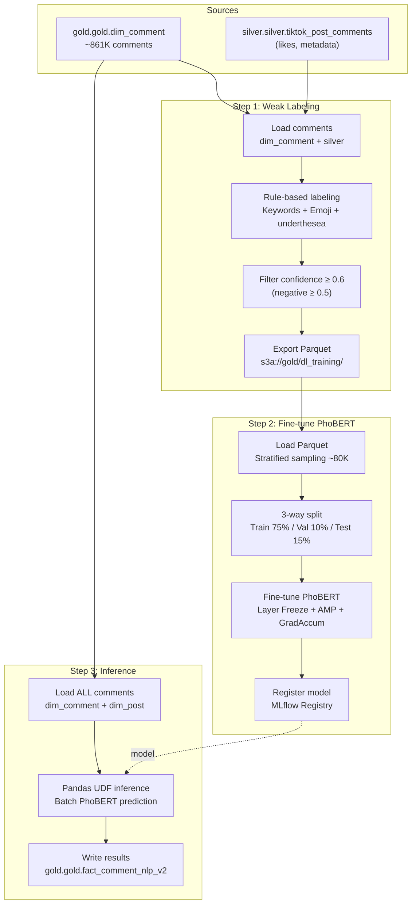
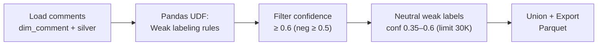
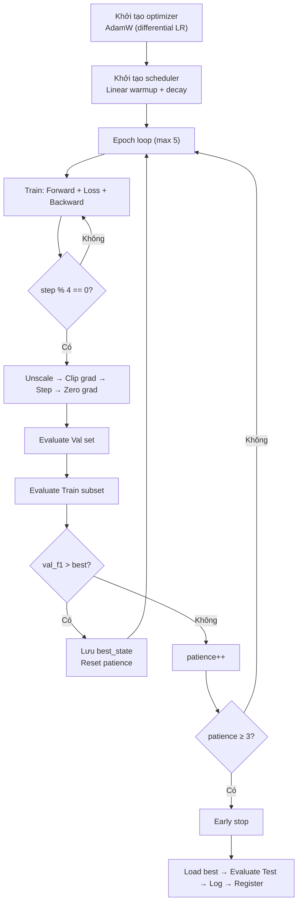
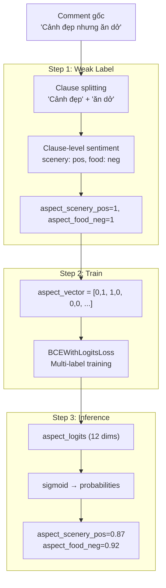

# Tài Liệu Kỹ Thuật: PhoBERT NLP Pipeline — Tourism Comment Analysis

> **Package**: [`spark/jobs/dl/nlp/`](file:///d:/CodeStored/Nam_4/TieuLuanCuoiKy/LakeHouse/LakeHousePj/spark/jobs/dl/nlp)  
> **Model name**: `tourism_comment_nlp`  
> **Registry**: MLflow Model Registry  
> **Output table**: `gold.gold.fact_comment_nlp_v2`

---

## Mục Lục

1. [Tổng Quan Pipeline](#1-tổng-quan-pipeline)
2. [Kiến Trúc Module & Luồng Dữ Liệu](#2-kiến-trúc-module--luồng-dữ-liệu)
3. [Module: config.py — Cấu Hình Trung Tâm](#3-module-configpy--cấu-hình-trung-tâm)
4. [Step 1: Weak Labeling — weak_labeling.py](#4-step-1-weak-labeling--weak_labelingpy)
5. [Step 2: PhoBERT Fine-tuning — train_phobert.py](#5-step-2-phobert-fine-tuning--train_phobertpy)
6. [Step 3: PhoBERT Inference — inference_phobert.py](#6-step-3-phobert-inference--inference_phobertpy)
7. [Kiến Trúc Model PhoBERTMultiTask](#7-kiến-trúc-model-phobertmultitask)
8. [Loss Functions & Training Strategy](#8-loss-functions--training-strategy)
9. [Aspect-Based Sentiment Analysis (ABSA)](#9-aspect-based-sentiment-analysis-absa)
10. [Output Schema & Data Destinations](#10-output-schema--data-destinations)
11. [Dependencies & Infrastructure](#11-dependencies--infrastructure)
12. [Ghi Chú Kỹ Thuật & Cải Tiến Tiềm Năng](#12-ghi-chú-kỹ-thuật--cải-tiến-tiềm-năng)

---

## 1. Tổng Quan Pipeline

Pipeline NLP này thực hiện **phân tích cảm xúc, nhận diện aspect, và phân loại intent** cho hơn 800K comment du lịch tiếng Việt từ TikTok, sử dụng mô hình **PhoBERT** (pre-trained Vietnamese BERT).

### 3 bước chính

| Step | File | Mô tả | Input | Output |
|------|------|-------|-------|--------|
| **Step 1** | [`weak_labeling.py`](file:///d:/CodeStored/Nam_4/TieuLuanCuoiKy/LakeHouse/LakeHousePj/spark/jobs/dl/nlp/weak_labeling.py) | Gán nhãn tự động bằng rule-based | `dim_comment` | Parquet (labeled data) |
| **Step 2** | [`train_phobert.py`](file:///d:/CodeStored/Nam_4/TieuLuanCuoiKy/LakeHouse/LakeHousePj/spark/jobs/dl/nlp/train_phobert.py) | Fine-tune PhoBERT multi-task | Labeled Parquet | MLflow model |
| **Step 3** | [`inference_phobert.py`](file:///d:/CodeStored/Nam_4/TieuLuanCuoiKy/LakeHouse/LakeHousePj/spark/jobs/dl/nlp/inference_phobert.py) | Inference trên toàn bộ comments | `dim_comment` + model | `fact_comment_nlp_v2` |

### Multi-task Learning

Model giải quyết đồng thời 2 tasks (3 heads nhưng chỉ train 2):

| Task | Kiểu bài toán | Số classes | Output |
|------|---------------|------------|--------|
| **Sentiment** | Multi-class classification | 3 (negative/neutral/positive) | Softmax probabilities |
| **Aspect** | Multi-label classification | 6 × 2 = 12 (pos/neg per aspect) | Sigmoid probabilities |
| **Intent** | Multi-class classification | 4 (recommend/complain/question/share) | *Chỉ khai báo, không train* |

> **Ghi chú**: Intent classification được khai báo trong config nhưng **không được train** trong `train_phobert.py` — head intent đã bị loại khỏi model class. Trong inference, `intent_label` luôn trả về `"share"` với `intent_confidence = 0.5`.

---

## 2. Kiến Trúc Module & Luồng Dữ Liệu



### File Structure

```
spark/jobs/dl/nlp/
├── __init__.py            # Package marker (rỗng)
├── config.py              # Cấu hình trung tâm: labels, keywords, hyperparams
├── weak_labeling.py       # Step 1: Rule-based auto-labeling
├── train_phobert.py       # Step 2: Fine-tune PhoBERT multi-task
└── inference_phobert.py   # Step 3: Score toàn bộ comments
```

---

## 3. Module: config.py — Cấu Hình Trung Tâm

> File: [`config.py`](file:///d:/CodeStored/Nam_4/TieuLuanCuoiKy/LakeHouse/LakeHousePj/spark/jobs/dl/nlp/config.py) (160 dòng)

Module này chứa **tất cả hằng số, labels, keyword lists, và hyperparameters** được share giữa 3 step.

### 3.1. Source Tables & Paths

| Hằng số | Giá trị | Mô tả |
|---------|---------|-------|
| `DIM_COMMENT_TABLE` | `gold.gold.dim_comment` | Bảng dimension comment (Gold layer) |
| `SILVER_COMMENTS_TABLE` | `silver.silver.tiktok_post_comments` | Bảng silver comment (lấy likes) |
| `LABELED_PARQUET_PATH` | `s3a://gold/dl_training/nlp_weak_labeled.parquet` | Output của Step 1, input của Step 2 |

### 3.2. Model Configuration

| Hằng số | Giá trị | Mô tả |
|---------|---------|-------|
| `PHOBERT_MODEL_NAME` | `vinai/phobert-base-v2` | Pre-trained PhoBERT backbone từ VinAI |
| `FINE_TUNED_MODEL_NAME` | `tourism_comment_nlp` | Tên model registered trong MLflow |
| `MAX_SEQ_LENGTH` | 128 | Chiều dài tối đa token (PhoBERT truncation) |
| `BATCH_SIZE` | 32 | Batch size per step |
| `LEARNING_RATE` | 2e-5 | Base learning rate |
| `EPOCHS` | 5 | Số epoch tối đa |
| `WARMUP_RATIO` | 0.1 | Tỷ lệ warmup steps |
| `TRAIN_TEST_SPLIT` | 0.75 | Train proportion |
| `VAL_SPLIT` | 0.10 | Validation proportion |
| `TRAIN_EVAL_SAMPLES` | 3000 | Subset train để track F1 per epoch |

### 3.3. Label Definitions

#### Sentiment Labels

```python
SENTIMENT_LABELS = ["negative", "neutral", "positive"]  # Index: 0, 1, 2
```

#### Aspect Labels (6 khía cạnh du lịch)

| Index | Label | Ý nghĩa | Ví dụ từ khoá |
|-------|-------|---------|---------------|
| 0 | `scenery` | Cảnh đẹp, thiên nhiên | cảnh, view, biển, núi, thác, hoàng hôn |
| 1 | `food` | Ẩm thực, đồ ăn | ăn, ngon, phở, hải sản, cà phê, đặc sản |
| 2 | `price` | Giá cả | giá, rẻ, đắt, tiết kiệm, chi phí, chặt chém |
| 3 | `service` | Dịch vụ | nhân viên, phục vụ, lễ tân, thái độ |
| 4 | `transport` | Di chuyển | xe, taxi, grab, bay, đường đi, km |
| 5 | `accommodation` | Lưu trú | khách sạn, homestay, phòng, booking |

#### Intent Labels (khai báo nhưng chưa train)

| Label | Ý nghĩa |
|-------|---------|
| `recommend` | Khuyên nghị, nên đi |
| `complain` | Phàn nàn |
| `question` | Hỏi thông tin |
| `share` | Chia sẻ trải nghiệm |

### 3.4. Keyword Lists

Pipeline sử dụng **6 danh sách từ khoá** cho weak labeling:

| Danh sách | Số từ khoá | Mục đích | Ví dụ |
|-----------|-----------|---------|-------|
| `POSITIVE_KEYWORDS` | ~40 | Nhận diện sentiment positive | đẹp, tuyệt vời, đỉnh, xịn, nên đi, 10 điểm |
| `NEGATIVE_KEYWORDS` | ~35 | Nhận diện sentiment negative | tệ, dở, chán, lừa đảo, thất vọng, đừng đi |
| `QUESTION_KEYWORDS` | ~17 | Nhận diện câu hỏi | bao nhiêu, ở đâu, cho hỏi, tư vấn, ? |
| `RECOMMEND_KEYWORDS` | ~13 | Nhận diện intent recommend | nên đi, recommend, 10/10, khuyên, gợi ý |
| `COMPLAIN_KEYWORDS` | ~14 | Nhận diện intent complain | phàn nàn, thất vọng, chặt chém, cảnh giác |
| `ASPECT_KEYWORD_MAP` | ~120 (tổng) | Map aspect → keywords | Dict 6 aspect × ~20 keywords mỗi aspect |

### 3.5. Emoji Signals

| Set | Số emoji | Ví dụ |
|-----|---------|-------|
| `POSITIVE_EMOJIS` | ~60 | 😍 ❤️ 🥰 👍 🔥 ✨ 🎉 🏖️ 🌊 💯 |
| `NEGATIVE_EMOJIS` | ~35 | 😢 😭 😡 🤬 🤮 💔 👎 😱 |

---

## 4. Step 1: Weak Labeling — weak_labeling.py

> File: [`weak_labeling.py`](file:///d:/CodeStored/Nam_4/TieuLuanCuoiKy/LakeHouse/LakeHousePj/spark/jobs/dl/nlp/weak_labeling.py) (421 dòng)

### 4.1. Tổng quan

**Mục đích**: Tự động gán nhãn cho >800K comments bằng rule-based approach (không cần human annotation), tạo training data cho PhoBERT.



### 4.2. Hàm `load_comments()`

> Dòng [63–84](file:///d:/CodeStored/Nam_4/TieuLuanCuoiKy/LakeHouse/LakeHousePj/spark/jobs/dl/nlp/weak_labeling.py#L63-L84)

SQL query join `dim_comment` với `tiktok_post_comments` để lấy:
- `comment_sk`, `comment_text`, `comment_level` (từ Gold)
- `comment_likes` (từ Silver — LEFT JOIN vì không phải comment nào cũng có)

**Filters**:
- `comment_text IS NOT NULL`
- `LENGTH(TRIM(comment_text)) > 3` — loại comment quá ngắn
- `is_active = TRUE`

### 4.3. Weak Labeling UDF — `create_weak_labeling_udf()`

> Dòng [87–300](file:///d:/CodeStored/Nam_4/TieuLuanCuoiKy/LakeHouse/LakeHousePj/spark/jobs/dl/nlp/weak_labeling.py#L87-L300)

Pandas UDF xử lý batch, trả về struct với 14 fields (sentiment + 12 aspect pos/neg pairs).

#### 4.3.1. Keyword Matching Logic

> Dòng [125–131](file:///d:/CodeStored/Nam_4/TieuLuanCuoiKy/LakeHouse/LakeHousePj/spark/jobs/dl/nlp/weak_labeling.py#L125-L131)

```python
def match_keyword(kw, text_str):
    if len(kw) <= 2:
        # Word boundary matching cho từ ngắn (ví dụ: "iu", "ok")
        # Sử dụng Vietnamese character class boundary
        pattern = r'(?<![VN_LETTERS])' + re.escape(kw) + r'(?![VN_LETTERS])'
    else:
        # Substring matching cho từ dài (ví dụ: "tuyệt vời")
        return kw in text_str
```

> **Thiết kế đáng chú ý**: Từ ngắn (≤2 ký tự) dùng regex word boundary với **Vietnamese character class** tùy chỉnh, tránh false positive (ví dụ: "ok" không match "tokyo").

#### 4.3.2. Global Sentiment Scoring

4 tín hiệu (signals) được tổng hợp:

| Signal | Weight | Mô tả |
|--------|--------|-------|
| **Keywords** | 1–3 | Đếm positive/negative keywords, cap tại 3 |
| **Emojis** | 1–3 | Đếm positive/negative emojis, cap tại 3 |
| **Exclamation** | 1 | ≥2 dấu `!` → weak positive signal |
| **underthesea** | 2 | Thư viện NLP tiếng Việt (nếu available) |

**Công thức confidence**:

```
signal_strength = min(total_signals / 5.0, 1.0)
ratio = dominant_signals / total_signals
confidence = min(0.95, 0.4 + ratio × 0.55 × signal_strength)
```

- Confidence range: [0.3, 0.95]
- Neutral default: 0.4 (không có tín hiệu), 0.5 (tín hiệu cân bằng)

#### 4.3.3. Clause-Level Aspect-Based Sentiment Analysis (ABSA)

> Dòng [234–294](file:///d:/CodeStored/Nam_4/TieuLuanCuoiKy/LakeHouse/LakeHousePj/spark/jobs/dl/nlp/weak_labeling.py#L234-L294)

**Đây là feature quan trọng nhất** — phân tích sentiment **theo từng mệnh đề** (clause), không phải toàn bộ comment:

```
Comment: "Cảnh đẹp lắm, nhưng đồ ăn dở quá"
          ↓ Split by "nhưng"
Clause 1: "Cảnh đẹp lắm"     → scenery: POSITIVE ✓
Clause 2: "đồ ăn dở quá"     → food: NEGATIVE ✓
```

**Logic**:
1. **Split** comment bằng dấu câu (`.,!?;\n`) và liên từ tương phản (`nhưng`, `tuy nhiên`, `bù lại`, `song`, `trong khi`)
2. Với mỗi clause:
   - Detect aspects bằng keyword matching (≥2 matches hoặc 1 match + clause ngắn ≤15 từ)
   - Tính local sentiment (pos/neg keywords + emojis trong clause)
3. Tổng hợp:
   - Nếu clause positive → `aspect_X_pos = 1.0`
   - Nếu clause negative → `aspect_X_neg = 1.0`
   - Nếu clause trung tính → fallback về global sentiment

### 4.4. Hàm `filter_confident_samples()`

> Dòng [348–379](file:///d:/CodeStored/Nam_4/TieuLuanCuoiKy/LakeHouse/LakeHousePj/spark/jobs/dl/nlp/weak_labeling.py#L348-L379)

Lọc samples theo confidence để training:

| Sentiment | Confidence threshold | Lý do |
|-----------|---------------------|-------|
| `positive` / `neutral` | ≥ 0.6 | Standard threshold |
| `negative` | ≥ 0.5 | Hạ threshold do class scarcity |

**FIX ISSUE-04 — Neutral weak labels**:

> Dòng [366–373](file:///d:/CodeStored/Nam_4/TieuLuanCuoiKy/LakeHouse/LakeHousePj/spark/jobs/dl/nlp/weak_labeling.py#L366-L373)

Thêm tối đa 30K samples neutral có confidence [0.35, 0.6) với flag `is_weak_label = True`. Mục đích: tăng lượng neutral data (thường bị thiếu). Những samples này sẽ được **label smoothing** trong training (xem mục 8).

### 4.5. Hàm `export_labeled_data()`

> Dòng [382–389](file:///d:/CodeStored/Nam_4/TieuLuanCuoiKy/LakeHouse/LakeHousePj/spark/jobs/dl/nlp/weak_labeling.py#L382-L389)

Export ra Parquet với `coalesce(4)` (4 partitions) tại:
```
s3a://gold/dl_training/nlp_weak_labeled.parquet
```

---

## 5. Step 2: PhoBERT Fine-tuning — train_phobert.py

> File: [`train_phobert.py`](file:///d:/CodeStored/Nam_4/TieuLuanCuoiKy/LakeHouse/LakeHousePj/spark/jobs/dl/nlp/train_phobert.py) (557 dòng)

### 5.1. Optimization Techniques (v2)

| # | Kỹ thuật | Chi tiết | Hiệu quả |
|---|---------|---------|-----------|
| 1 | **Layer Freezing** | Freeze embeddings + 8/12 transformer layers | ~50% fewer trainable params, chống catastrophic forgetting |
| 2 | **Mixed Precision (FP16)** | `torch.autocast` + `GradScaler` (GPU only) | ~2× speedup, giảm memory |
| 3 | **Gradient Accumulation** | 4 steps → effective batch = 128 | Smoother gradients, ổn định hơn |
| 4 | **Early Stopping** | Patience = 3, theo dõi Val Sentiment F1 | Tránh overfitting |
| 5 | **Differential LR** | Backbone: 2e-5, Heads: 1e-4 | Giữ knowledge backbone, train heads nhanh |
| 6 | **Stratified Sampling** | Up to 27K/class (~80K total) | Class balance |

### 5.2. Hàm `load_and_prepare_data()`

> Dòng [164–227](file:///d:/CodeStored/Nam_4/TieuLuanCuoiKy/LakeHouse/LakeHousePj/spark/jobs/dl/nlp/train_phobert.py#L164-L227)

1. **Load Parquet** từ S3 via Spark → convert sang Pandas
2. **Encode labels**: `sentiment_label` → `sentiment_id` (0/1/2)
3. **Aspect vector encoding**: Mỗi aspect có 2 giá trị (neg, pos) → vector 12 chiều

```python
# Ví dụ: comment đề cập scenery (positive) và food (negative)
aspect_vector = [
    0.0, 1.0,  # scenery: neg=0, pos=1
    1.0, 0.0,  # food: neg=1, pos=0
    0.0, 0.0,  # price: không đề cập
    0.0, 0.0,  # service
    0.0, 0.0,  # transport
    0.0, 0.0,  # accommodation
]
```

4. **Stratified sampling**: Max 27K per sentiment class → ~80K total

### 5.3. Hàm `create_dataloaders()`

> Dòng [230–288](file:///d:/CodeStored/Nam_4/TieuLuanCuoiKy/LakeHouse/LakeHousePj/spark/jobs/dl/nlp/train_phobert.py#L230-L288)

**3-way stratified split**:

```
Tổng ~80K samples
    ↓
├── Train: 75% (~60K) — dùng cho training
├── Val:   10% (~8K)  — dùng cho early stopping
└── Test:  15% (~12K) — chỉ dùng cho final evaluation
```

Split 2 bước:
1. Tách Test (15%) ra trước, stratified theo `sentiment_id`
2. Tách Val (~10/85 ≈ 11.8%) từ phần còn lại

**4 DataLoaders**:
| Loader | Mục đích | Shuffle |
|--------|---------|---------|
| `train_loader` | Training chính | ✓ |
| `val_loader` | Early stopping monitoring | ✗ |
| `test_loader` | Final evaluation duy nhất | ✗ |
| `train_eval_loader` | 3000 samples từ train để track overfit | ✗ |

### 5.4. CommentDataset

> Class [`CommentDataset`](file:///d:/CodeStored/Nam_4/TieuLuanCuoiKy/LakeHouse/LakeHousePj/spark/jobs/dl/nlp/train_phobert.py#L129-L157)

Mỗi sample trả về dict gồm:

| Key | Shape | Mô tả |
|-----|-------|-------|
| `input_ids` | `(128,)` | Token IDs từ PhoBERT tokenizer |
| `attention_mask` | `(128,)` | Mask padding tokens |
| `sentiment` | scalar (long) | Sentiment label ID (0/1/2) |
| `aspects` | `(12,)` | Aspect vector (neg/pos × 6 aspects) |
| `use_sent` | scalar (bool) | Flag: có dùng cho sentiment loss không |
| `is_weak` | scalar (bool) | Flag: đây có phải weak label không |

### 5.5. Layer Freezing — `apply_layer_freezing()`

> Dòng [104–122](file:///d:/CodeStored/Nam_4/TieuLuanCuoiKy/LakeHouse/LakeHousePj/spark/jobs/dl/nlp/train_phobert.py#L104-L122)

```
PhoBERT Architecture (12 transformer layers):
┌────────────────────────────┐
│  Embeddings        FROZEN  │
├────────────────────────────┤
│  Layer 0–7         FROZEN  │  ← 8 layers frozen
├────────────────────────────┤
│  Layer 8–11      TRAINABLE │  ← 4 layers trainable
├────────────────────────────┤
│  Sentiment Head  TRAINABLE │
│  Aspect Head     TRAINABLE │
└────────────────────────────┘
```

In log: `Trainable: X/Y (Z%)` — thường khoảng 50% params trainable.

### 5.6. Training Loop — `train_model()`

> Dòng [295–487](file:///d:/CodeStored/Nam_4/TieuLuanCuoiKy/LakeHouse/LakeHousePj/spark/jobs/dl/nlp/train_phobert.py#L295-L487)



#### Differential Learning Rate

```python
optimizer = AdamW([
    {"params": backbone_params, "lr": 2e-5,  "weight_decay": 0.01},  # Thận trọng
    {"params": head_params,     "lr": 1e-4,  "weight_decay": 0.01},  # Mạnh hơn 5×
])
```

#### Scheduler: Linear Warmup + Decay

```python
total_steps = (len(train_loader) // GRAD_ACCUM_STEPS) × EPOCHS
warmup_steps = total_steps × 0.1  # 10% warmup

# LR profile:
# ─────/─────\──────\──────\─────
#  warmup     linear decay to 0
```

#### Overfit Monitoring

Mỗi epoch tính:
- `train_f1`: F1 macro trên 3000 samples train
- `val_f1`: F1 macro trên val set
- `overfit_gap = train_f1 - val_f1`: Gap > 0.10 → cảnh báo ⚠️

### 5.7. Hàm `evaluate()`

> Dòng [494–516](file:///d:/CodeStored/Nam_4/TieuLuanCuoiKy/LakeHouse/LakeHousePj/spark/jobs/dl/nlp/train_phobert.py#L494-L516)

Đánh giá model trên DataLoader:
- **Sentiment F1**: macro average (cân bằng giữa 3 class)
- **Sentiment Accuracy**: overall accuracy
- `verbose=True` → in `classification_report` (precision/recall/f1 per class)

### 5.8. Plots & MLflow Logging

2 biểu đồ được log:

| Plot | Mô tả |
|------|-------|
| **Training Loss** | Loss per epoch (trái) |
| **Overfit Monitor** | Train F1 vs Val F1 + shaded gap area + best line (phải) |

MLflow params logged: model name, seq length, batch size, LR, freeze layers, grad accum steps, v.v.

---

## 6. Step 3: PhoBERT Inference — inference_phobert.py

> File: [`inference_phobert.py`](file:///d:/CodeStored/Nam_4/TieuLuanCuoiKy/LakeHouse/LakeHousePj/spark/jobs/dl/nlp/inference_phobert.py) (566 dòng)

### 6.1. Tổng quan

Score **toàn bộ** comments (~861K) bằng fine-tuned PhoBERT model → ghi kết quả vào Iceberg table.

### 6.2. Hàm `load_comments()`

> Dòng [183–208](file:///d:/CodeStored/Nam_4/TieuLuanCuoiKy/LakeHouse/LakeHousePj/spark/jobs/dl/nlp/inference_phobert.py#L183-L208)

SQL query khác với Step 1:
- **INNER JOIN** `dim_post` (lấy `province_sk` — bắt buộc)
- **LEFT JOIN** `tiktok_post_comments` (lấy `comment_likes`)
- Filter: `comment_text IS NOT NULL`, `LENGTH > 0`, `is_active = TRUE`, `province_sk IS NOT NULL`

### 6.3. Pandas UDF — `create_inference_udf()`

> Dòng [211–449](file:///d:/CodeStored/Nam_4/TieuLuanCuoiKy/LakeHouse/LakeHousePj/spark/jobs/dl/nlp/inference_phobert.py#L211-L449)

#### Model Loading (Once Per Executor)

```python
# Singleton pattern trên function attribute
if getattr(phobert_inference, '_model', None) is None:
    phobert_inference._model = mlflow.pytorch.load_model(f"models:/{FINE_TUNED_MODEL_NAME}/latest")
    phobert_inference._tokenizer = AutoTokenizer.from_pretrained(PHOBERT_MODEL_NAME)
    phobert_inference._device = torch.device("cpu")
```

> **Thiết kế quan trọng**: Model chỉ load **1 lần per executor** bằng cách cache vào function attribute. Nếu load fail → `_model = None` → tất cả rows trả default values.

#### Pre-compute Text Statistics

Trước khi chạy model, tính các basic stats cho mỗi comment:

| Stat | Mô tả |
|------|-------|
| `word_count` | Số từ (split by whitespace) |
| `unique_word_ratio` | Tỷ lệ từ unique / tổng từ |
| `emoji_count` | Tổng số emoji |
| `positive_emoji_count` | Số emoji positive (theo POSITIVE_EMOJIS set) |
| `negative_emoji_count` | Số emoji negative (theo NEGATIVE_EMOJIS set) |

#### Text Cleaning

```python
def _clean(t):
    s = re.sub(r'http\S+|www\S+|@\w+', '', s)  # Xoá URL, mention
    return ' '.join(s.split()).strip()            # Normalize whitespace
```

#### Mini-batch Inference

> Dòng [374–446](file:///d:/CodeStored/Nam_4/TieuLuanCuoiKy/LakeHouse/LakeHousePj/spark/jobs/dl/nlp/inference_phobert.py#L374-L446)

- Batch size: 32 (mini-batch trong Pandas UDF batch)
- Skip texts có `len < 3` → default values
- Tokenize → Forward pass → Extract probabilities

#### Sentiment Score Computation

```python
sentiment_score = (positive_prob - negative_prob + 1) / 2
# Range: [0, 1] — 0.5 = neutral, >0.5 = positive, <0.5 = negative
```

#### Aspect Score Computation

Model output 12 logits (6 aspects × 2: neg, pos). Sau sigmoid:

```python
# Mention score (có đề cập aspect hay không):
aspect_mention = max(neg_prob, pos_prob)  # Cao nhất trong 2

# Aspect sentiment pairs (cho ABSA):
aspect_X_pos = sigmoid(logit_pos)  # Xác suất positive cho aspect X
aspect_X_neg = sigmoid(logit_neg)  # Xác suất negative cho aspect X
```

**Aspect detection threshold**: `ASPECT_THRESHOLD = 0.5` — nếu mention score ≥ 0.5, aspect được ghi vào `aspect_labels` (comma-separated string).

#### Default Values (fallback)

Khi model không load được hoặc text quá ngắn:

| Field | Default |
|-------|---------|
| `sentiment_score` | 0.5 |
| `sentiment_label` | `"neutral"` |
| `intent_label` | `"share"` |
| `intent_confidence` | 0.5 |
| Tất cả aspect scores | 0.0 |

### 6.4. Hàm `run_inference()`

> Dòng [452–500](file:///d:/CodeStored/Nam_4/TieuLuanCuoiKy/LakeHouse/LakeHousePj/spark/jobs/dl/nlp/inference_phobert.py#L452-L500)

Apply UDF lên column `comment_text` → extract tất cả nested fields → thêm metadata (`comment_likes`, `comment_level`, timestamps).

### 6.5. Hàm `write_results()` & Schema Evolution

> Dòng [503–513](file:///d:/CodeStored/Nam_4/TieuLuanCuoiKy/LakeHouse/LakeHousePj/spark/jobs/dl/nlp/inference_phobert.py#L503-L513) và [85–181](file:///d:/CodeStored/Nam_4/TieuLuanCuoiKy/LakeHouse/LakeHousePj/spark/jobs/dl/nlp/inference_phobert.py#L85-L181)

`create_nlp_v2_table()` thực hiện:
1. Tạo Iceberg table nếu chưa tồn tại
2. **Schema evolution**: Kiểm tra và `ALTER TABLE ADD COLUMN` cho các column mới (aspect pos/neg pairs, unique_word_ratio, emoji counts)
3. Write mode: **overwrite** toàn bộ table

### 6.6. Spark Configuration đặc biệt

| Config | Giá trị | Lý do |
|--------|---------|-------|
| `spark.network.timeout` | 800s | Inference chậm, tránh timeout |
| `spark.executor.heartbeatInterval` | 60s | Tăng heartbeat interval |
| `spark.sql.execution.arrow.maxRecordsPerBatch` | 64 | Giới hạn records per Pandas UDF batch |

---

## 7. Kiến Trúc Model PhoBERTMultiTask

> Class [`PhoBERTMultiTask`](file:///d:/CodeStored/Nam_4/TieuLuanCuoiKy/LakeHouse/LakeHousePj/spark/jobs/dl/nlp/train_phobert.py#L79-L101)

```
Input: (input_ids, attention_mask)
          │
          ▼
┌─────────────────────────────────────────────────────┐
│  PhoBERT Backbone (vinai/phobert-base-v2)           │
│  12 Transformer Layers                              │
│  Hidden size: 768                                   │
│                                                     │
│  [CLS] token → last_hidden_state[:, 0, :]          │
└─────────────────────┬───────────────────────────────┘
                      │ (batch, 768)
                      ▼
              ┌───────┴───────┐
              │   Dropout(0.3) │
              └───┬───────┬───┘
                  │       │
         ┌────────┘       └────────┐
         ▼                         ▼
┌──────────────────┐     ┌──────────────────┐
│ Sentiment Head   │     │ Aspect Head      │
│ Linear(768→128)  │     │ Linear(768→128)  │
│ ReLU             │     │ ReLU             │
│ Dropout(0.3)     │     │ Dropout(0.3)     │
│ Linear(128→3)    │     │ Linear(128→12)   │
│                  │     │                  │
│ 3 classes:       │     │ 12 outputs:      │
│ neg/neu/pos      │     │ 6 aspects × 2    │
│ → Softmax        │     │ (neg, pos each)  │
└──────────────────┘     │ → Sigmoid        │
                         └──────────────────┘
```

### Chi tiết kiến trúc

| Component | Input | Output | Params |
|-----------|-------|--------|--------|
| PhoBERT backbone | (batch, 128) tokens | (batch, 128, 768) hidden states | ~135M |
| [CLS] extraction | (batch, 128, 768) | (batch, 768) | 0 |
| Dropout | (batch, 768) | (batch, 768) | 0 |
| Sentiment head | (batch, 768) | (batch, 3) | 768×128 + 128×3 = 98,688+384 |
| Aspect head | (batch, 768) | (batch, 12) | 768×128 + 128×12 = 98,688+1,536 |

> **Ghi chú**: Aspect head output 12 giá trị = 6 aspects × 2 (neg, pos). Đây là thiết kế cho **Aspect-Based Sentiment Analysis** — mỗi aspect có xác suất positive và negative riêng.

---

## 8. Loss Functions & Training Strategy

### 8.1. Loss Functions

| Task | Loss | Mô tả |
|------|------|-------|
| **Sentiment** | `CrossEntropyLoss` | Multi-class classification |
| **Aspect** | `BCEWithLogitsLoss` | Multi-label classification (sigmoid internal) |

### 8.2. Loss Weighting

```python
total_loss = sentiment_loss × 0.8 + aspect_loss × 0.2
```

Sentiment chiếm 80% tổng loss vì đây là task chính.

### 8.3. Per-sample Masking & Label Smoothing

> Dòng [374–386](file:///d:/CodeStored/Nam_4/TieuLuanCuoiKy/LakeHouse/LakeHousePj/spark/jobs/dl/nlp/train_phobert.py#L374-L386)

**FIX ISSUE-02 — Per-task loss masking**:

```python
# Chỉ tính sentiment loss cho samples có use_for_sentiment = True
loss_s = (loss_s * u_sent).sum() / max(u_sent.sum(), 1)
```

**FIX ISSUE-04 — Label smoothing cho weak labels**:

```python
# Weak labels: dùng label_smoothing=0.1
# Strong labels: dùng hard labels (no smoothing)
loss_s = torch.where(is_weak, loss_s_smooth, loss_s_unreduced)
```

> **Rationale**: Weak labels (neutral với confidence thấp) không đáng tin 100% → label smoothing giảm overconfidence. Strong labels (high confidence) giữ nguyên hard target.

### 8.4. Gradient Accumulation

```python
# Chia loss cho GRAD_ACCUM_STEPS trước backward
loss = total_loss / GRAD_ACCUM_STEPS

# Mỗi 4 steps:
amp_scaler.unscale_(optimizer)
clip_grad_norm_(model.parameters(), max_norm=1.0)
amp_scaler.step(optimizer)
optimizer.zero_grad()
```

Effective batch size = 32 × 4 = **128** — tương đương batch lớn hơn mà không cần thêm GPU memory.

---

## 9. Aspect-Based Sentiment Analysis (ABSA)

### Pipeline ABSA End-to-End



### Output Format

Với mỗi aspect (6 aspects), output gồm:

| Column | Ý nghĩa | Range |
|--------|---------|-------|
| `aspect_{name}` | Mention probability = max(neg, pos) | [0, 1] |
| `aspect_{name}_pos` | Xác suất sentiment positive cho aspect | [0, 1] |
| `aspect_{name}_neg` | Xác suất sentiment negative cho aspect | [0, 1] |
| `aspect_labels` | Comma-separated list aspects có mention ≥ 0.5 | String |

---

## 10. Output Schema & Data Destinations

### 10.1. Bảng `gold.gold.fact_comment_nlp_v2`

> Dòng [86–139](file:///d:/CodeStored/Nam_4/TieuLuanCuoiKy/LakeHouse/LakeHousePj/spark/jobs/dl/nlp/inference_phobert.py#L86-L139)

**Partition by**: `province_sk`

| # | Column | Type | Mô tả |
|---|--------|------|-------|
| | **Keys** | | |
| 1 | `comment_sk` | Long | Primary key |
| 2 | `post_sk` | Long | FK → dim_post |
| 3 | `province_sk` | Int | FK → dim_province (partition key) |
| 4 | `comment_date_sk` | Int | FK → dim_date |
| | **Sentiment** | | |
| 5 | `sentiment_score` | Double | Continuous score [0,1] — 0.5=neutral |
| 6 | `sentiment_label` | String | negative / neutral / positive |
| 7 | `sentiment_confidence` | Double | Max probability [0,1] |
| 8 | `sentiment_negative_prob` | Double | P(negative) |
| 9 | `sentiment_neutral_prob` | Double | P(neutral) |
| 10 | `sentiment_positive_prob` | Double | P(positive) |
| | **Aspects (mention)** | | |
| 11–16 | `aspect_{name}` | Double | Mention probability [0,1] |
| 17 | `aspect_labels` | String | Comma-separated detected aspects |
| | **Aspects (sentiment pairs)** | | |
| 18–29 | `aspect_{name}_pos/neg` | Double | Sentiment probability per aspect [0,1] |
| | **Intent** | | |
| 30 | `intent_label` | String | Luôn "share" (chưa train) |
| 31 | `intent_confidence` | Double | Luôn 0.5 |
| | **Text Stats** | | |
| 32 | `word_count` | Int | Số từ |
| 33 | `unique_word_ratio` | Double | Từ unique / tổng từ |
| 34 | `emoji_count` | Int | Tổng emoji |
| 35 | `positive_emoji_count` | Long | Emoji positive |
| 36 | `negative_emoji_count` | Long | Emoji negative |
| 37 | `comment_likes` | Long | Likes (từ silver) |
| 38 | `comment_level` | Int | Level trong comment tree |
| | **Metadata** | | |
| 39 | `created_at` | Timestamp | Thời điểm tạo record |
| 40 | `updated_at` | Timestamp | Thời điểm cập nhật |

### 10.2. Intermediate: Labeled Parquet

**Path**: `s3a://gold/dl_training/nlp_weak_labeled.parquet`  
**Columns**: `comment_text`, `sentiment_label`, `sentiment_confidence`, `aspects`, 12 aspect pos/neg columns, `use_for_sentiment`, `is_weak_label`, v.v.

---

## 11. Dependencies & Infrastructure

### Python Dependencies

| Package | Mục đích | Module sử dụng |
|---------|----------|----------------|
| `transformers` | PhoBERT tokenizer & backbone | train, inference |
| `torch` (PyTorch) | Deep learning framework | train, inference |
| `pyspark` | Distributed processing, Iceberg | Tất cả |
| `scikit-learn` | Metrics, train_test_split | train |
| `mlflow` | Experiment tracking, model registry | train, inference |
| `matplotlib` | Training curves | train |
| `underthesea` | Vietnamese NLP sentiment | weak_labeling (optional) |
| `emoji` | Emoji detection | weak_labeling, inference |
| `pandas`, `numpy` | Data manipulation | Tất cả |

### Infrastructure

| Component | Endpoint | Vai trò |
|-----------|----------|---------|
| **MinIO** | `http://minio:9000` | Object storage (model artifacts, parquet) |
| **MLflow** | `http://mlflow:5000` | Experiment tracking & model registry |
| **Hive Metastore** | `thrift://hive-metastore:9083` | Iceberg catalog |
| **Spark** | Local/cluster | Distributed processing |
| **Hugging Face Hub** | Remote (cached `/tmp/huggingface`) | Download pre-trained PhoBERT |

### Spark Catalog Configuration

| Catalog | Database | Warehouse | Mô tả |
|---------|----------|-----------|-------|
| `gold` | `gold` | `s3a://gold/lakehouse` | Gold layer — output tables |
| `silver` | `silver` | `s3a://silver/lakehouse` | Silver layer — raw comment metadata |

---

## 12. Ghi Chú Kỹ Thuật & Cải Tiến Tiềm Năng

### Các thiết kế đáng chú ý

| # | Thiết kế | Giải thích |
|---|---------|-----------|
| 1 | **Clause-level ABSA trong weak labeling** | Split comment theo dấu câu + liên từ tương phản → phân tích sentiment từng mệnh đề. Cho phép 1 comment có cả positive và negative aspects |
| 2 | **Weak label + Label smoothing** | Neutral samples confidence thấp được giữ lại nhưng đánh dấu `is_weak_label=True` → apply label smoothing 0.1 khi training. Giảm noise từ weak labels |
| 3 | **Per-task loss masking** | `use_for_sentiment` flag cho phép mask sentiment loss cho samples không đủ tin cậy, trong khi vẫn dùng aspect labels |
| 4 | **Singleton model loading** | Trong Pandas UDF, model cache vào function attribute → load 1 lần per executor. Tránh OOM khi Spark tạo nhiều tasks |
| 5 | **Vietnamese word boundary matching** | Từ khoá ngắn (≤2 ký tự) dùng regex với custom Vietnamese character class → tránh false positive |
| 6 | **Negative threshold thấp hơn** | Negative samples thường ít hơn → hạ threshold xuống 0.5 (vs 0.6 cho positive/neutral) |

### Intent Head — Tồn Tại Nhưng Không Hoạt Động

| Sự kiện | Chi tiết |
|---------|---------|
| **Config** | `INTENT_LABELS` và `INTENT_TO_ID` được khai báo đầy đủ |
| **Weak labeling** | `QUESTION_KEYWORDS`, `RECOMMEND_KEYWORDS`, `COMPLAIN_KEYWORDS` được khai báo nhưng **không sử dụng** |
| **Model** | `PhoBERTMultiTask` chỉ có 2 heads (sentiment + aspect), **không có intent head** |
| **Training** | `loss_int_fn = nn.CrossEntropyLoss()` khai báo nhưng **không dùng** |
| **Inference** | `intent_label` luôn = `"share"`, `intent_confidence` luôn = 0.5 |

> **Kết luận**: Intent classification đã bị **disable** trong quá trình phát triển nhưng code khai báo vẫn còn. Toàn bộ intent-related code là dead code.

### Potential Issues

| # | Issue | Mức độ | Giải thích |
|---|-------|--------|-----------|
| 1 | **CPU-only inference** | Medium | Inference chạy trên CPU (`torch.device("cpu")` hardcoded trong UDF). Với 861K comments × 128 tokens, đây là bottleneck chính |
| 2 | **underthesea dependency** | Low | `underthesea` import best-effort trong weak labeling. Nếu không có → mất signal mạnh (weight=2) cho sentiment |
| 3 | **Schema evolution via ALTER TABLE** | Low | Dùng try/except để ALTER TABLE thêm columns mới — có thể fail silently nếu Iceberg version không hỗ trợ |
| 4 | **`maxRecordsPerBatch` = 64** | Info | Giới hạn cực thấp để tránh OOM khi load model per batch. Trade-off: tăng overhead Pandas UDF |
| 5 | **Sentiment score formula** | Info | `(pos - neg + 1) / 2` — neutral score khi pos=neg, nhưng không tận dụng neutral probability. Ví dụ: P(neg)=0.4, P(neu)=0.2, P(pos)=0.4 → score=0.5 (neutral) dù model không chắc chắn |

### So sánh Weak Labeling vs PhoBERT

| Khía cạnh | Weak Labeling (Step 1) | PhoBERT (Step 3) |
|-----------|----------------------|-----------------|
| **Phương pháp** | Rule-based (keywords + emoji + underthesea) | Trained neural network |
| **Tốc độ** | Nhanh (~phút) | Chậm (giờ trên CPU) |
| **Chất lượng** | Noisy, confidence-based | Learned representations |
| **ABSA** | Clause-level splitting (hard rules) | End-to-end learned (soft probabilities) |
| **Coverage** | 100% comments labeled | 100% comments scored |
| **Vai trò** | Tạo training data | Final production scoring |

---

> **Tài liệu cập nhật**: 2026-07-11  
> **Code files**: `__init__.py` (1 dòng), `config.py` (160 dòng), `weak_labeling.py` (421 dòng), `train_phobert.py` (557 dòng), `inference_phobert.py` (566 dòng) — Tổng: ~1705 dòng
